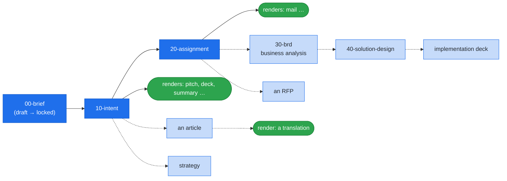

# Forge of Thought 4.5

*A workshop where thought is tempered and shaped.* · [Release notes](RELEASE-NOTES.md)

Forge of Thought is an **AI cognitive extension** of a thinking human,
the **principal** — whoever's thinking is being forged. It takes a
raw, half-formed idea — a process redesign, a platform initiative, an
organisational change, a D&D campaign — and tempers it into a precise,
self-contained handover for whoever delivers it: a team, a colleague,
your future self. It rests on one principle — **the machine carries
every part of the work that is not deciding** — in three forms.

- **It thinks with you.** It interviews and probes, criticises,
  challenges and inspires; it extracts what you have not yet
  articulated and lays out options with their trade-offs. It
  proposes — you decide.
- **It keeps the work consistent.** Nothing wanders off in forgotten
  chats: the thinking lives in versioned, templated artefacts, with
  decisions, state and history keeping themselves in order and
  consistency guarded across every output.
- **It carries the tedious work.** Audience-facing outputs — a pitch,
  a deck, even this README — are **renders**: generated from the
  artefacts through recipes, regenerated whenever the thinking moves,
  never written by hand twice.

Technically, Forge of Thought is a git repository: slash commands and
isolated agents — challenger personas and critic lenses — for Claude
Code, templates, and the conventions binding them. Today the chain
runs from a brief through an intent to an assignment; that is where it
currently ends.

## 1. Better with AI, or replaced by it?

Forge of Thought is for those who chose to be better. The failure
modes it exists to remove:

- Thinking scattered across chat sessions that die, taking their
  context with them.
- Handovers whose completeness depends on the mood of the day they
  were written.
- The same thinking retold to every audience — a pitch, a deck, a
  mail — each version rewritten by hand and drifting from the others.
- Feedback and decisions with no place to land, so the same ground is
  fought over twice.
- Assumptions nobody attacked before reality did.

## 2. What you get

- A versioned document chain growing from a brief — your own text,
  locked verbatim once it is done — to a self-contained assignment.
- An elicitation interview that forges the intent.
- Blind adversarial reviewers, every verdict recorded.
- Audience-specific renders generated from recipes, including an
  actual PowerPoint file through your own template.
- External sources registered immutably and used only as the
  principal directs.
- Everything in files and git — nothing depends on a chat's memory.

## 3. Quickstart

First, once per machine:

```
git clone …                # this repository — you are looking at it
                           # install Claude Code first — see Setup
claude                     # always from the engine root
/setup                     # first run only — fills CLAUDE.local.md,
                           # sets the model (Fable)
```

**Starting a new project**

```
/new-project my-idea
/forge intent
/save
```

**Bringing an existing project**

```
/import-project <project url>
    # clones into projects/ — the commit identity is proposed from
    # your identities.local.md roster and confirmed by you
/forge <project-slug>
    # the slug is the repository's name; select the project before
    # any work — the forge cannot guess it
```

Each project lives inside `projects/<slug>/` as a git repository of
its own, which the engine does not track — that is why you name it
first.

## 4. How it is used

### The flow

A thought arrives — a process you want redesigned, a platform you
want built, a campaign taking shape for your D&D table. You dump it
as it is, in whatever shape it has, into a brief: alone, or in
conversation with the forge (`/forge brief`), which clarifies where
you are terse and asks whether someone has solved this before. When
the text says what you mean, you lock it, and from then on it is
never touched again.

Then the forge interviews you. Over `/forge intent`, one question at
a time, it draws out what you want, why, what you take to be the
case, what is still open and what you have already dismissed — and
writes it down as positions, facts, threads and rejections with
stable IDs. This runs over days and sessions; nothing lives in the
chat, everything lives in files, and you can close the laptop at any
moment and pick up where you were.

Along the way material arrives. A colleague sends the transcript of
a meeting; you download a security standard the intent will later be
verified against. `/ingest` files each one into `sources/`, registers
it and notes what it is for — and nothing more happens until you say
how it is to be used. Where a key topic needs grounding, `/research`
looks up current practice and keeps the durable answer.

When the intent feels solid, you send in the reviewers. A challenger
(`/challenge cto`) attacks the substance — the assumption you never
stated, the second-order effect, the organisational reality — and a
critic (`/critique clarity`) reads the documents for ambiguity and
contradiction. Neither has seen your conversation; both write dated
reports you settle one item at a time, and nothing they say blocks
you.

Now the outputs. The assignment (`/forge assignment`) is distilled
from the intent for the people who will carry the work — the one
document they receive. And because the group wants a pitch, you
compose a recipe for it — a genre interview (`/recipe presentation`)
walks you through audience, message and dramaturgy — and `/render`
generates the deck from the artefacts, slide by slide, down to the
actual PowerPoint file. When the thinking moves, you regenerate; you
never rewrite the slides by hand. This README came into being the
same way.

`/save` commits it all as you go; `/release` re-renders the README
and release notes and marks the state you stand behind.

### What it looks like in practice

A worked example from a real project will appear here once one is
published.

## 5. How the work feels

The forge is as much a way of working as a set of files, and these
are the named methods of that work — the vocabulary you and Claude
share.

- **Walkthrough.** Any list of items needing your decision — critique
  findings, challenges, open threads — is worked one item at a time,
  in order of weight: Claude's recommendation with a one-sentence
  reason first, your verdict in a word or a counter-proposal, and
  "leave it open" is a legitimate answer. Never a table asking for
  every verdict at once; one item per message, the next opening with
  one line acknowledging your last verdict.
- **Propose, never decide.** Claude criticises, challenges, inspires
  and lays out options; you compose.
- **Step by step.** Anything hard to reverse — a write, a commit, a
  push, a rename — arrives as one step with the exact operation, its
  target and the reason, and runs on your word; a plan you have seen
  is not consent for its steps.
- **Elicitation interview.** Claude draws out by questions what you
  have not yet articulated, rather than filling the gap by assumption.
- **Draft early.** An early draft is an elicitation tool, not an
  output: concrete text sharpens your reaction.
- **Reflect back.** Before anything is written, Claude restates what
  it understood, so the write confirms rather than surprises.
- **Intent-first.** A change of substance goes into the intent and
  propagates from there; only wording is fixed downstream directly.
- **Recommend, do not push.** Every option comes with a
  recommendation and its reason, stated once; a declined
  recommendation is not re-argued without new facts.

None of these is a command: you invoke any of them in a word.

## 6. Roles

| Role | What they own |
|---|---|
| **Principal** | Whoever's thinking is being forged: supplies ideas, answers and decisions, and is the final authority on all content. |
| **Claude** | The principal's cognitive extension: structure, order, process discipline and document hygiene; criticises, challenges, inspires and lays out options, proposes and never decides. |
| **Recipients** | Whoever receives the assignment — teams, colleagues or the principal's future self; the machinery of executing delivery is theirs. |

The standing rules of the collaboration: when unsure, Claude asks and
never fills a gap by assumption; no new convention, prefix or section
is introduced unilaterally — proposed, decided, then written down;
many iterations are the normal mode; key topics are researched before
anything is invented; every critique and checklist is advisory and
only the principal publishes; structure with stable IDs beats prose
even at high abstraction; artefacts are written once per iteration
round, on confirmation; and every mechanism the forge has lives in
one place and is used from there. One instance serves one principal,
and recipients collaborate through the artefacts; more principals
means more instances (see Planned extensions).

## 7. The document chain



**Blue = chain artefacts (light = not built yet), green = renders;
dashed arrows = growth that does not exist yet.**

Adding a layer is one definition file declaring its inputs — nothing
is renumbered and nothing existing is reworked, which is why files
are numbered in tens. The boundary between chain and render is
authorship: a chain artefact is composed by the principal, a render
is generated from artefacts — the article and its translation in the
diagram illustrate it.

| File | What it is | Audience | Behaviour |
|---|---|---|---|
| `00-brief.md` | The idea as the principal wrote it; later wholes as `00-brief-<name>.md`. | principal + Claude | Draft until locked at 1.0, then immutable. |
| `10-intent.md` | The consolidated current understanding: positions, facts, threads, rejections. | principal + Claude | Rewritten freely, versioned. |
| `20-assignment.md` | The direction handed to the recipients, self-contained. | the recipients | Rewritten freely between approvals, versioned. |
| `<file>.history.md` | The Version History of a versioned document, beside it. | principal + Claude | Append-only companion. |
| `decisions.md` | The principal's decisions with reasons (DEC). | principal + Claude | Append-only. |
| `ledger.md` | Single source of truth for state. | principal + Claude | Freely rewritten. |

> A locked brief is immutable — composed, then locked, never touched
> again.

A **brief** is an intent that is composed and then locked. It is the
principal's own text: free-form, any structure he finds useful —
prose, headings, tables, use cases — with no required content and no
IDs, only a minimal YAML header. It holds thoughts to be processed,
not decisions: they may be changed, reworked or dropped when mined.
It is `draft` while being composed and `approved` (1.0) once the
principal locks it. Three origins are equally legitimate and
indistinguishable to the forge: it arrives finished and is locked on
arrival; it is begun outside and finished with Claude; it is born in
the forge — `/forge brief [name]` is the door for the latter two. A
project may have more than one: every later whole of thinking that
would otherwise land in the intent as a batch of unproven positions
is born as `00-brief-<name>.md` under the same rules. A locked brief
is mined into the single intent, positions citing it as provenance;
a whole that dies on the way leaves the brief locked and one
rejection (REJ) with the reason; the ledger's Briefs table tracks how
far each brief is mined (`pending | partial | mined | dropped`). Each
locked brief is the provenance anchor and drift measure of its whole.

The **intent** (`10-intent.md`) is the working document and the
consolidated *current* state of the principal's thinking: what he
wants (positions, POS), what is the case (facts, FCT), what is still
open (threads, THR) and what was dismissed and why (rejected
directions, REJ), each with a stable ID. It is rewritten for
coherence every round rather than appended, with every change
recorded in its history companion. It exists because chat context
dies and anything of value must live in a file: it is the document
to read when returning to a project after weeks, instead of
excavating old conversations. Its audience is the principal and
Claude only.

The **assignment** (`20-assignment.md`) is distilled from the intent
for the recipients and is the one document they receive. It carries
requirements, out-of-scope items, constraints, assumptions,
deliverables, open questions with an owner and optional success
criteria (REQ, OOS, CON, ASM, DEL, TBC, SCR) — the full in-scope
substance of the intent, written as well and as precisely as
possible; leaving a matter out is legitimate only as an explicit
delegation. It assigns rather than solves, and it is self-contained:
forwarded without oral tradition.

Substance changes go into the intent first and propagate to the
assignment; only wording is fixed downstream directly. Artefacts are
written once per iteration round, on the principal's confirmation —
one version bump, one history row for the whole round. Feedback from
recipients has no channel of its own: the principal processes it and
feeds conclusions back through `/forge intent`.

> A render is never edited by hand — what is iterated is its recipe.

**Renders and recipes.** A render is an audience-specific output
generated from the chain — a pitch for the group, an architecture
picture, an executive summary, the repository README. Its **recipe**
(`recipes/<recipe>.md`) holds inputs, audience, instructions and the
output template in one versioned file; `/render <recipe>` regenerates
the output into `renders/<recipe>.md` — or the recipe's own `output:`
path — overwriting freely, with history in git. Generation runs in an
isolated subagent that sees only the recipe and its inputs. Every
render opens with YAML front-matter provenance citing the recipe and
each input with their versions, and a render may itself serve as an
input of another render when the citing recipe declares it — a deck
slide citing an architecture picture. A recipe carries a version and
an updated date but no status, since a recipe is never approved. A
render assigns nothing and is not part of the chain: the artefacts
stay the source of truth.

**From Markdown to slides.** Everything the forge produces is
Markdown, renders included: a presentation is a `.md` saying what is
on each slide. Composing a recipe may be guided by genre — `/recipe
presentation` interviews you through the deck's audience, message,
dramaturgy and build instructions. The one in-house conversion is
`scripts/md2pptx.ps1`: it turns a Markdown deck render into an actual
PowerPoint file through headless Claude Code — an LLM conversion by
design, because deck definitions are free-form and may carry
instructions for the model — with a `.potx` template named by path,
typically a document of a library project. The generated `.pptx`
lands beside the render and is tracked in git like any render output;
the Markdown stays the source of truth. All other format conversion
happens outside the forge.

## 8. Isolated reviewers

Every reviewer runs as an isolated subagent that sees the project's
documents only, never the working conversation: they cannot be told
what we really meant, and that clean context is the source of their
value. Every kind of reviewer is of one shape — one agent file per
lens, persona or check, the behaviour shared by the kind preloaded
from one contract skill — and all run on the session model: speed is
bought with context, never with a weaker reviewer. All are invoked by
hand and settled by walkthrough; nothing they report blocks anything.

Isolation is not independence. The author, the critic and the
challengers share one model family; what that family systematically
cannot see, none of them will find, so agreement between the
reviewers is never treated as validation — it only means the
artefact is consistent under one set of priors. The calibration point
lies outside the forge: review by humans or by a different model
family, invited at the principal's discretion.

### Critic (`/critique`)

The **critic** judges the quality of the documents — never the
substance of the thinking. `/critique <lens> [artefact]` runs one
lens on the named artefact, or on the whole chain when none is named;
bare `/critique` lists the roster and recommends a fit.

- `clarity` — reads each artefact on its own for ambiguity,
  contradiction, duplication, scope hygiene and Requirement style.
- `essence` — reads the chain for drift: distils each layer's essence
  blind and compares it with the layer above.

Output: an immutable dated report `reviews/YYYY-MM-DD-critique-<lens>.md`
with findings (FND) mirrored in the ledger. Finding states:

- open
- resolved
- overruled (→ DEC)
- obsolete

### Challenger (`/challenge`)

The **challenger** judges the substance of the thinking — never
document quality. `/challenge <persona> [artefact]` sends one persona
against the named artefact, or the whole chain when none is named;
bare `/challenge` lists the roster and recommends a fit for the
project's subject.

- `cto` — CTO-level peer reviewer: challenges the substance of the
  principal's thinking — assumptions, blind spots, second-order
  effects, organisational reality; not a document auditor.

Output: an immutable dated report
`challenges/YYYY-MM-DD-challenge-<persona>.md` with challenges (CHL)
mirrored in the ledger; an accepted challenge must change the intent.
Challenge states:

- open
- accepted
- rejected (→ DEC)
- parked
- obsolete

### Checks (`/check`)

A check judges mechanical conformance with the conventions — never
substance or quality. `/check <check> [slug]` runs one check on the
named project or on the engine; bare `/check` lists the roster.

- `light` — verifies a project's bookkeeping: front-matter against the
  history companion, ledger tables against the files, dependencies and
  resource indexes against the directories; fit for a save.
- `project` — verifies a project's structure, IDs, assignment style,
  language, immutables, recipes and renders against the conventions.
- `engine` — verifies the core (CLAUDE.md, templates, skills, agents,
  scripts) against itself and against the forge intent: every position
  honoured, nothing withdrawn still advertised, every decision
  reflected.
- `single-source-of-truth` — verifies that every rule, procedure and
  file shape is written in one place and cited everywhere else: no
  restatement across CLAUDE.md, skills, agents, templates and scripts,
  no direct operation where a mechanism exists; the honest sweep,
  expensive by design.

Output: a report returned to the session, nothing filed. Each finding
is settled there:

- fix
- defer
- accept

## 9. Commands

Every command is a skill of the engine; the table mirrors the
command set in full.

| Command | Purpose |
|---|---|
| `/setup` | First run after cloning the engine: fills `CLAUDE.local.md` and `identities.local.md` by interview, sets the model to Fable and offers the global git identity guard. Never overwrites, runs no git operation. |
| `/new-project <slug>` | Scaffolds a project by kind — files only, never git: a thought project with its brief captured verbatim, or a library (`lib-`) of shared material. |
| `/import-project <git-url>` | Brings an existing project into `projects/` through `scripts/forge-clone.ps1`; the directory is the repository's name, the commit identity proposed from `identities.local.md`. |
| `/forge [slug]` | The chain map: artefacts, versions, stale renders and a recommended next step. |
| `/forge <state> [slug]` | Iterates the named artefact (`brief [name]`, `intent`, `assignment`, …). |
| `/ingest [file] [slug]` | Stores and registers external input in `sources/` and indexes it; bare, sweeps `sources/`. |
| `/render <recipe> [slug]` | Regenerates a render from its recipe in `recipes/`. |
| `/recipe [genre] [slug]` | Bare, the genre roster; with a genre (`presentation`, `readme`, `release-notes`), guided composition or iteration of a render recipe. |
| `/critique [lens] [artefact] [slug]` | Bare, the critic lens roster; with a lens, runs that critic on the named artefact, else on all. |
| `/challenge [persona] [artefact] [slug]` | Bare, the challenger persona roster; with a persona, runs that challenger against the named artefact, else the whole chain. |
| `/research <topic> [slug]` | Best-practice research stored in `research/` and indexed. |
| `/ledger [slug]` | The quick state readout from the ledger. |
| `/check [check] [slug]` | Bare, the check roster; with a check (`light`, `project`, `engine`, `single-source-of-truth`), runs it on the named project or on the engine. |
| `/save [slug] [-m "message"] [-Tag name]` | Saves one repository, or every one with changes: the light check, then commit and push on the current branch. |
| `/release [slug] [-m "message"] [-Tag name]` | Releases one repository from `main`: its checks, the README and release notes re-rendered, then a save with the release message and the major's tag. |
| `/spinoff <project> <group> <slug>` | Splits a requirement group into a project of its own — only on the principal's explicit decision. |

`/forge` and `/ledger` differ in reach: `/forge` reads the chain and
tells you where you stand and what to do next; `/ledger` reads the
ledger and tells you the state of everything registered. `/forge
<state>` has nothing to memorise: the command is simply the name of
the artefact you want to work on — `/forge intent`, `/forge
assignment` — and a layer added later brings its own name.

`/ingest` stores, registers and catalogues — nothing more: a source
is immutable from registration, its role (a standard to verify
against, inspiration, a meeting record) is noted in the directory's
`00-INDEX.md`, and how and when it is used is the principal's call.
A binary is converted to a Markdown extract through
`scripts/doc2md.ps1` only on the principal's explicit word, and the
extract then is the source; a set of related files lives as one
bundle `sources/<slug>/` with its own catalogue. `/save` runs the
light check and then commits and pushes on whatever branch is checked
out, without rendering; `/release`, from `main` only, runs its checks,
offers `critique essence` once, re-renders the README and release
notes and then saves with the release message and, at an approved
major, the tag `v<major>`. Commands are entry points, not the only
door: plain conversation works too, and the same rules apply there.

### A typical journey

- You have an idea and write it down as it comes — or talk it into
  shape with the forge — then lock it as your brief (`/new-project`,
  `/forge brief`).
- The forge interviews you, one question at a time, and your intent
  takes shape as positions, facts, threads and rejections; you iterate
  over days, writing once per round (`/forge intent`).
- Material arrives — a transcript, a standard, an offer — and is
  filed and registered without being read into your thinking until
  you say so (`/ingest`).
- You send in a challenger against the substance and a critic against
  the documents, then work through their findings one at a time,
  recording every verdict (`/challenge cto`, `/critique clarity`).
- The group wants to hear it: you compose a presentation recipe and
  render the deck, down to the actual PowerPoint file (`/recipe
  presentation`, `/render`, `scripts/md2pptx.ps1`).
- The assignment is distilled from the intent for the people who will
  carry the work, complete and self-contained (`/forge assignment`).
- You save as you go and release when you stand behind the state;
  the README and release notes of your project regenerate themselves
  (`/save`, `/release`).

## 10. Conventions

**IDs and numbering.** Every item carries a global, stable ID of the
form `PREFIX.NNNN` — three-letter prefix, four digits — never
renumbered; items may move between groups without changing their ID.
Items are numbered in tens (`REQ.0010`, `REQ.0020`), each new group
starting at the next hundred (`REQ.0100`, `REQ.0110`); overflow takes
the next free number anywhere. Groups are plain headings with no IDs,
no metadata and no lifecycle, at most two levels deep.

| Prefix | Meaning | Lives in |
|---|---|---|
| REQ | requirement | assignment |
| OOS | out of scope / do-not | assignment |
| CON | constraint — deliberate boundary, not to be challenged | assignment |
| ASM | assumption | assignment |
| DEL | deliverable — may delegate work ("produce NFRs and return") | assignment |
| TBC | open question / to be confirmed, with owner | assignment |
| SCR | success criterion — optional or delegated | assignment |
| POS | position the principal currently holds | intent |
| THR | open thread — unresolved matter to elicit next | intent |
| REJ | rejected direction, with the reason it was dropped | intent |
| FCT | fact — what is the case, as the principal states it or as a source states it; not a stance; provenance to the file where a source exists, never demanded | intent |
| FND | critique finding (document quality) | ledger, reviews |
| CHL | peer-review challenge (substance) | ledger, challenges |
| DEC | decision, incl. overruled findings and rejected challenges | decisions.md |

**Terms.** Every assignment carries a Terms section listing the
prefixes and the domain terms it actually uses, so that it can be
forwarded without oral tradition; defined terms are capitalised in
item text to signal they appear there.

**Language.** The forge dictates one output language per project: the
artefacts of the chain — intent, assignment, later layers — are
written in the language the project's ledger header declares
(`language`, English when absent). The briefs are the exception,
stored verbatim in whatever language they were written. Everything
else a project holds — ledger, decisions, history, reviews,
challenges, indexes, research, recipes — is always English, as is the
notation throughout (ID prefixes, `shall`, status words, front-matter
keys). A render may be in any language its recipe declares. The
language of the working conversation is per-instance configuration
and lives in `CLAUDE.local.md`.

**Requirement style.** Requirements use **shall** / **shall not** —
never would, could, should, might, may or MoSCoW wording. There is no
priority column and no priority tag: everything in an assignment is
essential by default, and an exception carries a note reading
*optional*. Each item covers one idea, is written once, and is
written in full, correct UK English sentences; no item depends on an
external link to be understood, agreed or later tested. Testability
is recommended, not required — delegating concretisation through a
DEL item is a legitimate outcome, and the critic reports untestable
wording as a recommendation, never as a blocking defect. For
illustration only:

> REQ.0010 The Platform shall record every request and every response
> passing through the Gateway, with the identity of the requesting
> User and the time.

**Completeness over brevity.** An assignment carries the full in-scope
substance of the intent, written as well and as precisely as
possible; nothing is omitted for brevity's sake, and length is
whatever fidelity requires. Leaving a matter out is legitimate only
as an explicit delegation — a DEL or TBC item. An assignment assigns,
it does not solve: the machinery of executing delivery belongs to the
recipients, while any apparatus may appear where the principal judges
it part of setting direction.

**Versioning.** Integers denote signed-off versions: `0.1, 0.2, …`
are drafts before first approval; `1.0` is approved; `1.1, 1.2, …`
are changes made after approval, not yet approved themselves; `2.0`
is the next approved version, incorporating all changes since `1.0`.
Front-matter carries `version`, `date`, `status`
(`draft | in_review | approved | superseded`) and `last_change`, and
the status must agree with the number. Immutable documents — a
locked brief, reviews, challenges, sources, research — are never
edited; corrections happen downstream.

**Document kinds.** "Document" is the word for every file of a
project; "artefact" is reserved for the documents of the chain — the
ones the principal composes, the reviewers read and the renders are
generated from. Every document has one kind, and the kind says what
it is, who writes it, whether it is versioned and how it behaves:

| Group | Kind | Meaning | Written by | Versioned | Behaviour |
|---|---|---|---|---|---|
| artefacts | brief | the idea as the principal wrote it | principal | yes | locked at 1.0, then immutable |
| artefacts | intent | current understanding for principal and Claude: positions, facts, threads, rejections | Claude, principal composes | yes | rewritten freely |
| artefacts | assignment | the direction handed to the recipients, self-contained | Claude, principal composes | yes | rewritten freely |
| artefacts | later artefacts (BRD, RFP, article…) | further layers, each derived from the one above | Claude, principal composes | yes | rewritten freely |
| records | history | what changed in a versioned document, and why | forge | — | append-only |
| records | decisions | the principal's decisions with reasons | forge | — | append-only |
| records | review, challenge | one dated reviewer run | reviewer agent | — | immutable |
| state | ledger | single source of truth for state | forge | — | freely rewritten |
| state | index | catalogue of a resource directory | forge | — | freely rewritten |
| rendering | recipe | how a render is made | Claude, principal iterates | yes | iterated, never approved |
| rendering | render | audience-specific output, never a source of truth | generated | — | overwritten by /render |
| resources | source | external input as it arrived | external, /ingest | — | immutable |
| resources | research | durable answer to one question | Claude, /research | — | immutable |

Every versioned kind keeps its Version History in an append-only
companion `<file>.history.md` beside it, never in its body, and the
`last_change` line of the front-matter summarises the newest row,
written by the same step that appends it. An integer version is
approved, and a recipe never is.

**Project kinds and naming.** A project has a kind, declared in the
YAML header of its ledger: `thought` — the chain, the default — or
`library` — shared material used across projects, with no chain: a
ledger, sources and research with their indexes, and a README as the
catalogue of what it holds. A library carries the `lib-` prefix. A
project is named by its slug — lowercase, hyphenated, the name of its
directory under `projects/` and of its repository; the system's own
project is `forge`, and a library is `lib-<name>`. Display names may
differ from slugs.

## 11. Repository layout

```
CLAUDE.md                  # this file — universal core
CLAUDE.local.md            # instance facts (principal, conversation
                           # language) — gitignored, created by
                           # /setup from templates/CLAUDE.local.md
identities.local.md        # git identities — gitignored, loaded by
                           # nobody, read by path by /setup,
                           # /new-project and /import-project
README.md                  # for humans — a render (/render readme)
RELEASE-NOTES.md           # release notes — a render (/render
                           # release-notes): one section per
                           # release, compiled from the Notes of
                           # the intent's history rows; minors
                           # fold into a major
logo.png                   # project avatar
LICENSE                    # CC BY 4.0 — the engine is published
                           # under attribution
scripts/                   # forge-save / forge-pull / forge-status
                           # / forge-clone / forge-branch (git),
                           # doc2md (document →
                           # Markdown), md2pptx (deck render →
                           # PowerPoint)
.claude/                   # skills (the commands and the reviewers'
                           # contracts), agents, settings
                           # (settings.local.json: the session
                           # model — gitignored)
templates/                 # canonical skeletons
projects/                  # gitignored (projects/*) except
                           # projects/forge — every other project is
                           # a git repository of its own, which the
                           # engine does not know
projects/<slug>/           # kind: thought — the chain
  .git/                               # the project's own repository
  README.md  RELEASE-NOTES.md         # renders (Document chain 7)
  logo.png                            # optional project avatar
  00-brief.md  10-intent.md  20-assignment.md
  00-brief-<name>.md                  # later briefs, one per whole
  <file>.history.md                   # Version History of each
                                      # versioned document (brief,
                                      # intent, assignment, recipe):
                                      # append-only companion
  decisions.md  ledger.md             # ledger header carries kind:
  sources/00-INDEX.md                 # resource index (rewritten)
  sources/<name>.<ext>                # immutable external inputs, one
                                      # form each: <slug>.md extract of
                                      # a binary, or the binary itself
  sources/.gitignore                  # originals converted in place
  sources/<slug>/                     # bundle of related files = one
                                      # source, one ledger entry;
                                      # catalogued by its 00-INDEX.md
  research/00-INDEX.md                # resource index (rewritten)
  recipes/<recipe>.md                 # render recipes: inputs, audience,
                                      # instructions, template — iterated
  recipes/<recipe>.history.md         # the recipe's Version History
  renders/<recipe>.md                 # generated outputs, overwritten by
                                      # /render, provenance front-matter
  renders/<recipe>.pptx               # optional deck generated from the
                                      # md render by scripts/md2pptx.ps1
  reviews/YYYY-MM-DD-critique-<lens>.md  # immutable critique runs
  challenges/YYYY-MM-DD-challenge-<persona>.md  # immutable peer reviews
  research/YYYY-MM-DD-<topic>.md      # immutable research notes
  CLAUDE.md                # optional project-specific polish
projects/lib-<name>/       # kind: library — material shared across
  .git/  ledger.md         # projects, no chain: only the ledger,
  README.md  logo.png      # sources and research; documents
  recipes/readme.md        # maintained by their owner; README =
  sources/00-INDEX.md      # the catalogue, a render of its recipe
  research/00-INDEX.md
```

## 12. Setup

### Prerequisites

- git.
- PowerShell 7 (`pwsh`) — the scripts are PowerShell and run
  unchanged on Windows, macOS and Linux, so it is needed on
  macOS/Linux too.
- Python 3, for markitdown (used by `doc2md.ps1`).
- A paid Claude subscription.

### Getting the forge and Claude Code

Clone this repository — it is the engine. Then install Claude Code:

- Windows: `irm https://claude.ai/install.ps1 | iex`
- macOS/Linux: `curl -fsSL https://claude.ai/install.sh | bash`
- or, with Node.js: `npm install -g @anthropic-ai/claude-code`

Sign in on first run; usage draws from the same pool as Claude chat.
Always start `claude` from the engine root, so that `CLAUDE.md` and
`CLAUDE.local.md` load.

Then run `/setup` once. In a short interview it fills
`CLAUDE.local.md` (who the principal is, the conversation language)
and `identities.local.md` (your git identities per host) from their
templates — both gitignored, never committed — and creates
`.claude/settings.local.json` with the session model set to Fable,
the strongest available model, which the whole forge including the
blind reviewers runs on; it tells you so in one sentence, and
`/model` or editing that file changes it at any time (permissions
come from the shared `.claude/settings.json`). It closes by offering
one global git guard — `user.useConfigOnly = true` appended to
`~/.gitconfig` — so that a repository without a local identity fails
aloud instead of committing with a default; declined, it prints the
line for you to apply by hand. The identities themselves are set per
repository, proposed from your roster at every project creation or
import. `/setup` never overwrites existing files.

### Your projects

Each project is a directory under `projects/` and a git repository of
its own. `/new-project` creates the files; `git init` in that
directory (`git -C projects/<slug> init -b main`) and a remote, if you
want one, are a one-off act of yours. The commit identity belongs to
the project: it is set locally in the repository, proposed from the
identity roster in `identities.local.md` by the origin's host and
confirmed by you. An existing project is brought in with
`/import-project <git-url>`, which clones it into
`projects/<repository name>` through `scripts/forge-clone.ps1`, sets
the identity you confirm and reports the identity the clone ended up
with. The engine ignores `projects/*` (except its own
`projects/forge`) and the scripts find your project through its
`.git`. A project without a repository is reported as "not under
git" — a fact, not an error.

### Script prerequisites

- `doc2md.ps1` needs markitdown:
  `pip install "markitdown[docx,pptx,pdf,xlsx,xls]"`.
- `md2pptx.ps1` needs the `document-skills` plugin, installed once
  from an interactive Claude Code session:
  `/plugin marketplace add anthropics/skills`, then
  `/plugin install document-skills@anthropic-agent-skills`. A deck
  template is named by path (`-Template <file.potx>`) — typically a
  document of a library project — or none is given, in which case
  Claude designs the visuals.
- The git scripts (`forge-save`, `forge-pull`, `forge-status`,
  `forge-clone`, `forge-branch`) need nothing beyond git.

### Saving and syncing

Two doors, two speeds. `/save` runs the light check, then commits and
pushes on whatever branch is checked out — no render. `/release`,
from `main` only, runs its checks, settled with the principal, offers
`critique essence` once, re-renders the README and release notes and
then saves with the release message and, at an approved major, the
tag `v<major>`.

Beneath both lie the scripts in `scripts/`, the only intended door to
git — reading state included, no exceptions — each serving the engine
and every project repository. A bare save commits each repository
with changes on its own and pushes where it has a remote. `main` is
the released line; branches are voluntary — `forge-branch` creates or
switches, merging stays with git, by hand or by merge request. One
remote per repository, and no URL anywhere in the forge: git carries
that information itself.

### Upgrading

Upgrading the engine is `scripts/forge-pull.ps1`, a fast-forward of
`main`; your projects are untouched by it and record no engine
version. Read `RELEASE-NOTES.md`, the *Action required* lines first:
they say what a new version expects of your projects and your
instance files. Then, project by project, run `/check project
<slug>`: it measures the project against the current conventions and
reports what no longer conforms, nothing else. Go through the
findings with Claude one at a time and agree what to migrate and how;
Claude makes the changes on your word, in the session, with no
migration tool in between — the check and the release notes are the
tool. A project you leave as it is stays valid under the conventions
it was written to; migrating it is your decision, per project, never
assumed.

## 13. Scripts

| Script | Purpose | When it runs | Install |
|---|---|---|---|
| `scripts/forge-save.ps1` | Commits and pushes the engine or a project repository — bare, every repository with changes, each its own commit. | Behind `/save` and `/release`; by hand from the shell. | git only. |
| `scripts/forge-pull.ps1` | Fast-forwards from the remotes; on the engine it is the upgrade channel. | When you upgrade the engine or sync a project. | git only. |
| `scripts/forge-status.ps1` | Reports the state of the engine and every project — changes, branch, last commit, remote or "not under git" — without changing anything. | Whenever you want to know where the repositories stand. | git only. |
| `scripts/forge-clone.ps1` | Brings an existing project in: clones it into `projects/<repository name>` and sets its commit identity when given one. | Behind `/import-project`. | git only. |
| `scripts/forge-branch.ps1` | Switches to a branch or creates one; merging is left to git. | When you want to work off `main`. | git only. |
| `scripts/doc2md.ps1` | Converts a binary document to the Markdown extract that becomes the source. | Behind `/ingest`, on the principal's explicit word per binary. | markitdown — see Setup, Script prerequisites. |
| `scripts/md2pptx.ps1` | Turns a Markdown deck render into a `.pptx` through headless Claude Code, with a `.potx` template named by path. | After a presentation render, when the actual PowerPoint file is wanted. | `document-skills` plugin — see Setup, Script prerequisites. |

## 14. Planned extensions

The chain is meant to keep growing downward: thoughts are forged as
far as the principal needs them taken. A BRD layer is certain to
come; solution architecture and integration are intended; a strategy
layer is possible if it proves to make sense. Which layers are added,
and in what order, is open, and nothing is approved for construction:
the mechanics of a layer are designed when that layer is actually
taken up, not in advance. The layers below the assignment grow in the
same project, by the same principal's hand — a BRD as his next layer,
not as someone else's deliverable; what a recipient does with an
assignment is his own forge run, the assignment becoming his brief.
The chain never spans two principals.

One instance serves one principal. A second principal receives the
engine — `projects/forge` included — through git and runs an instance
of their own; more principals means more instances, coordinated by
git. Genuine multi-user operation is an open question, deliberately
not worked on now.

`projects/forge/` is Forge of Thought itself run through its own
process: its brief, intent, decisions and ledger, with the engine's
README and release notes as renders of its recipes. A process change
is complete only once that intent is updated and the README
re-rendered.

## 15. Author and licence

Forge of Thought © Petr Chlumsky (PCHe) — petr.chlumsky@gmail.com.
Licensed under [CC BY 4.0](LICENSE): use and adapt it freely; credit
the author and link to this repository.

## 16. About this README

This file is a render of `projects/forge`: it is never edited by hand
and is regenerated by `/render readme` whenever the process changes —
and by every `/release` of the engine. Fixes go into the recipe
(`projects/forge/recipes/readme.md`) or into its inputs, `CLAUDE.md`
and the forge intent, never into this file. The YAML front-matter at
the top is the render's provenance and is kept by design. Changes to
the system itself are recorded in `projects/forge/`.

_Last updated: 2026-09-11_
