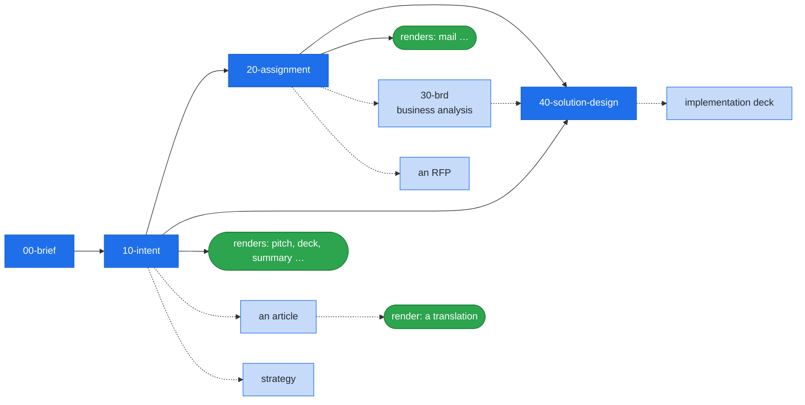

# Forge of Thought 4.58

*A workshop where thought is tempered and shaped.* · [Release notes](RELEASE-NOTES.md)

Forge of Thought is an **AI cognitive extension** of a thinking human,
the **principal**: whoever's thinking is being forged. It takes a raw,
half-formed idea (a process redesign, a platform initiative, an
organisational change, a D&D campaign) and tempers it into a precise,
self-contained handover for whoever delivers it: a team, a colleague,
your future self. It rests on one principle, **the machine carries
every part of the work that is not deciding**, in three forms.

- **It thinks with you.** It interviews and probes, criticises,
  challenges and inspires; it extracts what you have not yet
  articulated and lays out options with their trade-offs. It
  proposes — you decide.
- **It keeps the work consistent.** Nothing wanders off in forgotten
  chats: the thinking lives in versioned, templated artefacts, with
  decisions, state and history keeping themselves in order and
  consistency guarded across every output.
- **It carries the tedious work.** Audience-facing outputs (a pitch, a
  deck, even this README) are **renders**: generated from the
  artefacts through recipes, regenerated whenever the thinking moves,
  never written by hand twice.

Technically the forge is a git repository: slash commands and isolated
agents (challenger personas and critic lenses) for Claude Code,
templates, and the conventions binding them. It is a place where
thoughts are forged, and the chain of documents ends where a project
needs it to. Today the forge has four artefacts, a brief, an intent, an
assignment and a solution design; that is where the chain ends for
now, as a fact and not as its goal. Nothing is implemented here: the
forge specifies.

Short on time? Two one-page notes say it briefly:
[for a CTO](projects/forge/renders/cto-pitch.md) and
[for a CEO](projects/forge/renders/ceo-pitch.md). Each has a Word
version beside it.

## 1. Better with AI, or replaced by it?

Forge of Thought is for those who chose to be better. The failure
modes it exists to remove:

- Thinking scattered across chat sessions that die, taking their
  context with them.
- Handovers whose completeness depends on the mood of the day they
  were written.
- The same thinking retold to every audience (a pitch, a deck, a
  mail), each version rewritten by hand and drifting from the others.
- Feedback and decisions with no place to land, so the same ground is
  fought over twice.
- Assumptions nobody attacked before reality did.

## 2. What you get

- A versioned document chain growing from a **brief** (your idea put
  together, yours by your approval) through the **intent** to the
  layers your project needs, an **assignment** to hand over and a
  **solution design** among them.
- An elicitation interview that forges the intent.
- Blind adversarial reviewers, every verdict recorded.
- Audience-specific renders generated from **recipes**, including an
  actual PowerPoint file through your own template.
- External sources registered immutably and used only as the
  principal directs.
- Everything in files and git: nothing depends on a chat's memory.

## 3. Quickstart

First, once per machine:

```
# clone this repository          (you are looking at it)
# install Claude Code            (see Setup)
claude                           # always from the engine root
/setup                           # first run only - fills CLAUDE.local.md,
                                 # sets the model, Fable
```

**Starting a new project**

```
/new-project my-idea
/forge intent
/save
```

**Bringing an existing project**

```
/import-project <project url>    # clones into projects/ - the commit
                                 # identity is git's, resolved from
                                 # your own configuration
/forge <project-slug>            # the slug is the repository's name;
                                 # select the project before any work -
                                 # the forge cannot guess it
```

Each project lives inside `projects/<slug>/` as a git repository of
its own, which the engine does not track; that is why you name it
first.

## 4. How it is used

### The flow

A thought arrives: a change you want to make to how a team works, or a
campaign taking shape for your D&D table. You put it together as a
brief, alone or in conversation with the forge, in whatever shape the
thought has. It is rough on purpose.

Then you run `/forge intent` and the forge starts asking. Over days
and sessions the intent is forged from the brief: what you hold and
why, what is the case, what you dropped, what is still open.
Everything lives in files, so you can close the session at any point
and come back weeks later.

Material arrives while you think. A security standard you downloaded
goes in through `/ingest` and waits; later you ask for the intent to
be verified against it, and only then is it used. Where a topic needs
outside grounding, `/research` stores a durable note.

When the thinking stands, you let blind reviewers press on it: the
**critic** on the quality of the documents, the **challenger** on the
substance. They did not hear your conversation, so they read only
what is written. You go through what they found one item at a time
and every verdict is recorded. Nothing blocks you.

From the intent the assignment is distilled for the people who will
act on it, and where the way is not obvious a solution design says
how the things wanted are realised. For every audience there is a
render: a pitch for the group, slides including the actual PowerPoint
file, a mail, this very README. You iterate the recipe, composed if
you like through a genre interview, and the outputs are regenerated
from it; the README and the release notes at every release. `/save`
and `/release` keep it all in git.

### What it looks like in practice

A worked example from a real project will appear here once one is
published.

## 5. How the work feels

The forge is as much a way of working as a set of files, and these
are the named methods of that work, the vocabulary you and Claude
share.

- **Walkthrough.** Any list of items that needs your decision is
  worked one item per message, in order of weight, each proposition
  closed with the verdict line
  `(a)ccept / (m)odify / (r)eject / (p)ark`. You may answer with the
  single letter as your whole message, and the verdicts are carried
  to one write at the end of the round.
- **Propose, never decide.** Claude criticises, challenges, inspires
  and lays out options, and you compose; `??` at the end of your
  message asks for Claude's honest opinion of what you have just
  written.
- **Step by step.** Anything that needs your consent (a write, a
  commit, a push, a rename, the birth of a new versioned document)
  arrives as one step with its exact operation, target and reason,
  and runs on your word.
- **Elicitation interview.** Claude draws out by questions, one per
  message, what you have not yet articulated.
- **In pieces.** You may send one longer thought as several messages
  and close it with a word such as "done"; until then Claude only
  acknowledges, and afterwards works the pieces as one input.
- **Draft early.** An early draft is a tool for drawing the thought
  out, not an output: concrete text sharpens the reaction.
- **Reflect back.** Before anything is written, Claude restates what
  it understood, so that the write confirms rather than surprises.
- **One write per round.** A working conversation is one round: what
  is agreed is carried in the conversation and written once at its
  end, on your word, and the word is `write`.
- **Intent-first.** A change of substance goes into the intent and
  propagates from there down the whole chain the project has; only
  wording is fixed downstream directly.
- **Handing over.** How an artefact is composed is your choice,
  artefact by artefact: found together by questions, or handed over
  in a few sentences, in which case Claude returns a proposal with a
  short list of what it assumed and chose, and nothing is built on it
  before you have judged it.
- **Recommend, do not push.** Every option comes with a
  recommendation and its reason, stated once; a declined
  recommendation is not argued again without new facts.

None is a command: you invoke any of them in a word.

| You type | What it does |
|---|---|
| `a`, `m`, `r` or `p` | Answers the verdict line `(a)ccept / (m)odify / (r)eject / (p)ark`, as your whole message. |
| `write` | Orders the write of everything agreed in the round. Claude shows you the round first and writes on your yes. |
| `??` | Asks for Claude's honest opinion of what you have just written. Three points at most, nothing written. |

## 6. Roles

| Role | What they own |
|---|---|
| Principal | Whoever's thinking is being forged: supplies ideas, answers and decisions, and has the final authority on all content. |
| Claude | The principal's cognitive extension: owns structure, order, process discipline and document hygiene. |

The standing rules of the collaboration: when unsure, Claude asks and
never fills a gap by assumption; a contradiction, a gap or a risk it
finds is raised at once, as one question naming what does not fit.
What Claude brings as knowledge says in plain words whether it is
verified and on what, unverified, or a hypothesis. Claude never
introduces a new convention, prefix or section on its own: it
proposes, waits for a decision and then writes it down. Many
iterations are the normal mode. Critiques and checklists inform and
never block; only the principal publishes.

One instance of the forge serves one principal, and the recipients
collaborate through the artefacts; more principals means more
instances (see Planned extensions).

## 7. The document chain


```mermaid
flowchart LR
    B["00-brief"] --> I["10-intent"]
    I --> A["20-assignment"]
    I --> SD["40-solution-design"]
    A --> SD
    I --> RI(["renders: pitch, deck, summary …"])
    A --> RA(["renders: mail …"])
    A -.-> BRD["30-brd<br>business analysis"]
    BRD -.-> SD
    A -.-> RFP["an RFP"]
    I -.-> ART["an article"]
    ART -.-> RT(["render: a translation"])
    I -.-> ST["strategy"]
    SD -.-> IMP["implementation deck"]

    classDef built fill:#1f6feb,stroke:#1158c7,color:#ffffff
    classDef future fill:#c6dbfa,stroke:#1f6feb,color:#24292f
    classDef render fill:#2da44e,stroke:#1a7f37,color:#ffffff
    class B,I,A,SD built
    class BRD,RFP,ART,ST,IMP future
    class RI,RA,RT render
```

**Blue = chain artefacts (light = not built yet), green = renders;
dashed arrows = growth that does not exist yet.**

Adding a layer is one definition file declaring its inputs: nothing is
renumbered and nothing existing is reworked, which is why files are
numbered in tens. The boundary between the chain and a render is
authorship: a chain artefact is composed by the principal, a render is
generated from artefacts, as the article and its translation in the
diagram illustrate.

Every artefact has a definition, worked through `/forge <state>` and
paired with the artefact's template: the definition says how the
artefact is found, the template what comes out. The forge has these
artefacts and no others:

| File | Artefact | What it is | Found from |
|---|---|---|---|
| `00-brief.md`, `00-brief-<name>.md` | brief | The principal's idea put together, found with Claude or handed over, approved when done. | The principal's thought, with research, sources and Claude's proposals gathered around it. |
| `10-intent.md` | intent | The briefs chiselled into what the principal holds. | The briefs the principal says to mine, the decisions and the ledger; sources only as he directs. |
| `20-assignment.md` | assignment | The intent's in-scope substance carried to the recipients in a joint pass. | The intent with its threads, the decisions and the ledger. |
| `40-solution-design.md` | solution design | How the things wanted are realised, part by part, with the choices they rest on. | The lowest layer the project has above it (the intent alone, the assignment or a BRD) and whatever stands above that. |

Below the intent a project takes the layers it needs: none is a
condition of another, and a layer a project does not have is not
missing.

**The brief rule.** A brief is a draft until the principal approves
it and is changed after that as any artefact is; it is never locked.
Three origins are equally legitimate: it arrives finished from
outside and is stored as it came, it is begun outside and finished
with Claude, or it is born in the forge from the first word.
`/forge brief` is the door. Every later whole of thinking is born as
`00-brief-<name>.md` under the same rules, and each brief is mined
into the single intent when the principal says so, the ledger
tracking how far.

**The brief** puts the idea together: what the principal wants and
why, with what he chose to take from the finding around it. It is
free-form, with a minimal header, no required content and no IDs, and
it holds thoughts to be processed, not decisions. It is rough on
purpose, because the chiselling is the intent's work: a required
structure would force premature tidiness, and a brief polished until
the intent has nothing left to do has gone too far.

**The intent** is the working document: the consolidated current
state of what the principal holds. It keeps what matters as positions
(POS), what is the case as facts (FCT) and what was dropped as
rejections (REJ) with the reason, every position with its provenance;
what is undecided lives as threads (THR) in `threads.md` beside it,
one file for the project. It says what is wanted and why and does not
solve. `10-intent.md` exists because chat context dies and anything
of value must live in a file: it is the document to read when
returning to a project after weeks, instead of excavating old
conversations. It is rewritten for coherence each round, never
appended to, and it is complete for now when no thread blocks the
next layer; it is never finished.

**The assignment** carries the in-scope substance of the intent to
the recipients, complete and precise, so that they can act without
the principal in the room: who they are, what must be true at the
end, what is theirs to decide and bring back, what they shall not do
and what has been left open on purpose. Its items are requirements
(REQ), out-of-scope items (OOS), constraints (CON), assumptions
(ASM), deliverables (DEL), open questions (TBC) and success criteria
(SCR). It is found in a joint pass of three phases: questions only
for what the intent does not answer, a recast of the whole with a map
of where each item came from, and a walkthrough group by group. It is
shaped so because most items are craft derived from the intent, and
without the map one sees what is there, not what is missing.

**The solution design** says how the things wanted are realised, as
the solution stands today, and is kept current. It is read by whoever
realises the solution, a person or an agent, without the principal in
the room. It is made of parts (SOL), each saying what it answers for,
which items of the layer above it realises, the choice it rests on
with what it was chosen against and what it costs, and where it is
realised; what is open is a TBC with its owner. It holds what cannot
be read off the thing itself: why, against what, at what price and
how the parts fit. It is worth writing where the way is not obvious,
where a choice has a price, or where two hands would solve the same
matter differently; whether it is, the principal says.

Iteration: substance changes go into the intent first and propagate
down the chain, and drafting early is a legitimate tool.

Write cadence: artefacts are written once per round, on the
principal's confirmation, with one version bump for the whole round.

Feedback from recipients has no channel of its own: the principal
processes it and feeds the conclusions back through `/forge intent`.

> A render is never edited by hand: what is iterated is its recipe.

**Renders and recipes.** A render is an audience-specific output
generated from the chain; it assigns nothing and is never a source of
truth. Its recipe, `recipes/<recipe>.md`, holds the inputs, the
audience, the instructions and the output template in one versioned
file, and `/render <recipe>` regenerates the output from it. Every
render opens with its provenance as front-matter, citing the recipe
and its inputs. A render may serve as an input of another render,
when the citing recipe declares it among its inputs.

**From Markdown to slides.** Everything the forge produces is
Markdown. Composing a recipe may be guided by genre
(`/recipe presentation`). An output is made in two steps, each with
its own command. `/render` makes the Markdown and, where the recipe
names a format in its `Format` section, the plain `.docx` or `.pptx`
beside it through pandoc: cheap, the same every time, with Mermaid
diagrams landing as blocks of code. `/publish` makes the designed
file through a model into `published/`: expensive, started by the
principal only, taken from the Markdown as it lies on disk, never
rendering and sending nothing anywhere. A recipe without a format
ends at the Markdown. A template or a reference document is named by
path, typically a document of a library project, and the page is A4
by default. The Markdown stays the source of truth, and all other
format conversion happens outside the forge.

## 8. Isolated reviewers

The reviewers start from a clean context: they see the project's
documents only, never the working conversation, so they cannot be
told what we really meant. Every kind of reviewer is of one shape: an
isolated agent on the session model, invoked by hand, producing an
immutable dated report that is settled by walkthrough. No reviewer
runs on Claude's own judgement.

Isolation is not independence. The reviewers share the author's model
family: what that family systematically cannot see, none of them will
find, so their agreement is never treated as validation. The
calibration point lies outside the forge, in review by humans or by a
different model family, invited at the principal's discretion.

### Critic (`/critique`)

The critic judges the quality of the documents, never the substance.
It is run as `/critique <lens> [artefact]`; without an artefact it
reads the whole chain, and bare it lists the roster.

- `clarity` - reads each artefact on its own for ambiguity,
  contradiction, duplication, scope hygiene and Requirement style;
  fit before a handover.
- `essence` - reads the chain for drift: distils each layer's essence
  blind and compares it with the layer above; fit as soon as a second
  layer exists.

Output: findings (`FND`) in
`reviews/YYYY-MM-DD-critique-<lens>.md`. A finding is in one of these
states:

- `open`
- `resolved`
- `rejected`
- `parked`
- `obsolete`

### Challenger (`/challenge`)

The challenger judges the substance of the thinking, never document
quality. It is run as `/challenge <persona> [artefact]`; without an
artefact it reads the whole chain, and bare it lists the roster.

- `cto` - a CTO-level peer reviewer who challenges the substance of
  the principal's thinking: assumptions, blind spots, second-order
  effects, organisational reality.
- `architect` - a senior solution architect who challenges how the
  things wanted are realised: the choices, their price, how the parts
  fit and what will break first.

Output: challenges (`CHL`) in
`challenges/YYYY-MM-DD-challenge-<persona>.md`. A challenge is in one
of these states:

- `open`
- `accepted`
- `rejected`
- `parked`
- `obsolete`

### Checks (`/check`)

A check verifies mechanical conformance with the conventions, never
substance or quality. It is run as `/check <check> [slug]` on a
project or on the engine; bare it lists the roster. Each check owns
one concern, and checks never call each other.

- `light` - verifies a project's bookkeeping: front-matter against
  the history companion, ledger tables against the files,
  dependencies and resource indexes against the directories; fit for
  a save.
- `project` - verifies a project's structure, IDs, language,
  immutables, recipes and renders against the conventions.
- `engine` - verifies the core (CLAUDE.md, templates, skills, agents,
  scripts) against itself and against the forge intent: every
  position honoured, nothing withdrawn still advertised, every
  decision reflected.
- `single-source-of-truth` - verifies that every rule, procedure and
  file shape is written in one place and cited everywhere else; the
  honest sweep, expensive by design, fit before a major or after a
  round on the operating layer, not at every release.
- `history` - reads a document with its history and reports where the
  division between them does not hold, proposing each move in full;
  fit when a document is cleaned, never at a save or a release.

Output: findings (`FND`) in `reviews/YYYY-MM-DD-check-<name>.md`,
filed only when the check finds something. Their states are the
findings' states:

- `open`
- `resolved`
- `rejected`
- `parked`
- `obsolete`

## 9. Commands

The commands are entry points; what each does in full is printed by
`/man <command>`.

| Command | Purpose |
|---|---|
| `/setup` | First run after cloning the engine: prepares the instance. |
| `/new-project <slug>` | Scaffolds a project by kind: a thought project or a library. Files only, never git. |
| `/new-artefact <name>` | Adds a new kind of artefact to the forge. |
| `/import-project <git-url>` | Brings an existing project into `projects/`. |
| `/forge [slug]` | The chain map of a project, with a recommended next step. |
| `/forge <state> [slug]` | Iterates the target artefact through its definition. The command is simply the name of the artefact you want to work on. |
| `/ingest [file] [slug]` | Stores, registers and indexes external input in `sources/`. Bare, it sweeps `sources/`. |
| `/render <recipe> [slug]` | Regenerates a render from its recipe. |
| `/publish <recipe> [slug]` | Makes the designed file from a render, through a model. |
| `/recipe [genre] [slug]` | Composes or iterates a render recipe by genre. Bare, it lists the genres. |
| `/critique [lens] [artefact] [slug]` | Runs a critic lens on the quality of the documents. Bare, it lists the lenses. |
| `/challenge [persona] [artefact] [slug]` | Runs a challenger persona against the substance. Bare, it lists the personas. |
| `/research <topic> [slug]` | Researches current best practice into `research/`, indexed. |
| `/ledger [slug]` | The quick state readout from the ledger. |
| `/check [check] [slug]` | Runs a check on a project or on the engine. Bare, it lists the checks. |
| `/save [slug] [-m "message"] [-Tag name]` | Saves one repository, or every one with changes. |
| `/release [slug] [-m "message"] [-Tag name]` | Releases one repository from `main`. |
| `/spinoff <project> <group> <slug>` | Splits a requirement group into its own project, on the principal's explicit decision only. |
| `/man [command \| method]` | The forge's manual, read from its own definitions. |
| `/manual …` | Alias of `/man`. |

`/ingest` takes a file or text pasted into the conversation, stores
it under a short slug, records its origin date as best it can without
asking, and adds an index entry; then it asks what the source is for.
For every binary file it asks one question, whether to convert it to
Markdown: if so the extract is the source, if not the binary is kept
as a functional thing. Personal matter stops the command before
anything is stored. Nothing is processed: a registered source waits
for the principal. `/save` runs the light check, proposes a one-line
commit message drafted from the history records of the round, and
commits and pushes on your confirmation; a tag is set only on your
word. `/release` is always one repository: it runs its checks and
settles their findings with you, regenerates the README and the
release notes, tells you what materially changed in them, and then
saves with the message `release <intent version>: <one line>`.

The commands are not the only door: the same rules hold in plain
conversation.

### A typical journey

- You put your idea together as a brief, alone or with the forge
  (`/forge brief`).
- You forge the intent over as many sessions as it takes, answering
  questions and settling what is open (`/forge intent`).
- You let the reviewers press on it and rule on what they found, one
  item at a time (`/challenge`, `/critique`).
- You compose a presentation recipe and render it, including the
  PowerPoint file (`/recipe presentation`, `/render`, `/publish`).
- You distil the assignment for the people who will act on your
  project (`/forge assignment`).
- Where the way is not obvious, you write a solution design
  (`/forge solution-design`).
- You save as you go (`/save`) and release when a state is worth
  marking (`/release`).

## 10. Conventions

**IDs.** Every item has an ID of the form `PREFIX.NNNN`, all prefixes
three letters. IDs are global and stable, never renumbered, and an
item may move between groups without changing its ID. Items are
numbered in tens, each new group starting at the next hundred.
Groups are plain headings with no IDs, no metadata and no lifecycle,
two levels deep at most.

| Prefix | Meaning | Lives in |
|---|---|---|
| REQ | requirement | assignment |
| OOS | out of scope, do-not | assignment |
| CON | constraint: a deliberate boundary, not to be challenged | assignment |
| ASM | assumption | assignment |
| DEL | deliverable; may delegate work | assignment |
| TBC | open question, to be confirmed, with owner | assignment, solution design |
| SOL | part of the solution: what is built or done, what it realises, the choice it rests on | solution design |
| SCR | success criterion, optional or delegated | assignment |
| POS | position the principal currently holds | intent |
| THR | open thread: an unresolved matter, naming the artefact it concerns and carrying its origin | the project's `threads.md` |
| REJ | rejected direction, with the reason it was dropped | intent |
| FCT | fact: what is the case, as the principal or a source states it | intent |
| FND | finding of a critic or of a check | ledger, reviews |
| CHL | peer-review challenge | ledger, challenges |
| DEC | decision, including rejected findings and challenges | `decisions.md` |

**Terms.** Every assignment carries a Terms section listing the
prefixes and terms it actually uses, so that it can be forwarded
without oral tradition; defined terms are capitalised in item text.

**Language.** The forge dictates one output language per project: the
artefacts of the chain (intent, assignment, later layers) are written
in the language the project's ledger header declares (`language`,
English when absent). The briefs are the exception, kept in whatever
language they are written in. Everything else a project holds
(ledger, decisions, history, reviews, challenges, indexes, research,
recipes) is always English, as is the notation: ID prefixes, `shall`,
status words, front-matter keys. A render may be in any language its
recipe declares. The language of the conversation is configuration of
the instance and lives in `CLAUDE.local.md`.

**Requirement style.** The items of an assignment are written with
**shall** and **shall not**, in full correct sentences, one idea per
item, each written once; would, could, should, might, may and MoSCoW
wording are not used. There are no priorities: everything is
essential, and an exception carries a note reading *optional*.
Testability is recommended, not required. An item must not depend on
an external link to be understood, agreed or later tested. An
illustrative item:

> REQ.0010 The Platform shall record every request and every response
> passing through the Gateway, with the identity of the requesting
> User and the time.

**Completeness over brevity.** An assignment carries the full
in-scope substance of the intent: nothing is omitted for brevity's
sake, and length is whatever fidelity requires. Leaving a matter out
is legitimate only as an explicit delegation, a DEL or a TBC item.
Structure goes before prose: narrative is confined to Purpose &
Context and Objective.

**The boundary.** An assignment assigns, it does not solve: the
machinery of executing delivery belongs to the recipients.

**Versioning.** Integers denote signed-off versions:

- `0.1, 0.2, …` drafts before first approval
- `1.0` approved
- `1.1, 1.2, …` changes made after approval, not yet approved
  themselves
- `2.0` the next approved version, incorporating all changes since 1.0

The front-matter carries `version`, `date`, `status`
(`draft | approved | superseded`) and `last_change`.

**Document kinds.** "Document" is the word for every file of a
project, and "artefact" is reserved for the documents of the chain.

| Group | Kind | Meaning | Written by | Versioned | Behaviour |
|---|---|---|---|---|---|
| artefacts | artefact | a document of the chain; what each is, its definition says | the principal with Claude | yes | rewritten freely |
| records | history | what changed in a versioned document, and why | forge | — | append-only |
| records | decisions | the principal's decisions with reasons | forge | — | append-only |
| records | review, challenge | one dated reviewer run | reviewer agent | — | immutable |
| state | ledger | single source of truth for state | forge | — | freely rewritten |
| state | index | catalogue of a resource directory | forge | — | freely rewritten |
| rendering | recipe | how a render is made | Claude, principal iterates | yes | iterated, never approved |
| rendering | render | audience-specific output, never a source of truth | generated | — | overwritten by /render |
| resources | source | external input as it arrived | external, /ingest | — | immutable |
| resources | research | durable answer to one question | Claude, /research | — | immutable |

Every versioned document keeps its history in an append-only
companion `<file>.history.md` beside it, never in its body, with
`last_change` in the front-matter derived from the newest records. An
integer version is approved and anything else is not; a recipe is
never approved and stays 0.x.

The **ledger**, `ledger.md`, is the single source of truth for the
state of a project: it is freely rewritten and kept current after
every operation.

**Project kinds.** A project has a kind, declared in the header of
its ledger: `thought` is the chain; `library` is material shared
across projects, with the prefix `lib-` and no chain, only the
ledger, sources and research, its README the catalogue of what it
holds. Project slugs are lowercase and hyphenated on disk, and display
names may differ: the system's own project is `forge`, a library is
`lib-<name>`.

## 11. Repository layout

```
CLAUDE.md                  # the universal core: roles, rules, conventions
CLAUDE.local.md            # instance facts: who the principal is and
                           # the conversation language; gitignored
README.md                  # for humans — a render (/render readme)
RELEASE-NOTES.md           # release notes — a render (/render
                           # release-notes); the shape:
                           # templates/recipe-release-notes.md
CONTRIBUTING.md            # for a visitor who wants to say, ask or
                           # change something — a render (/render
                           # contributing)
logo.png                   # project avatar
LICENSE                    # CC BY 4.0 — the engine is published
                           # under attribution
scripts/                   # forge-save / forge-pull / forge-status
                           # / forge-clone / forge-branch (git),
                           # doc2md (document →
                           # Markdown), md2pptx (deck render →
                           # PowerPoint), md2docx (render → Word),
                           # each by pandoc or by a model,
                           # hook-walkthrough (the per-prompt hook
                           # of .claude/settings.json)
.claude/                   # skills (the commands, the reviewers'
                           # contracts and the walkthrough method),
                           # agents, settings
                           # (settings.local.json: the session
                           # model — gitignored)
templates/                 # canonical skeletons
projects/                  # gitignored (projects/*) except
                           # projects/forge — every other project is
                           # a git repository of its own, which the
                           # engine does not know
projects/<slug>/           # kind: thought — the chain
  .git/                               # the project's own repository
  README.md  RELEASE-NOTES.md         # renders of the project's own
                                      # recipes
  logo.png                            # optional project avatar
  00-brief.md  10-intent.md           # the trunk of every project
  NN-<layer>.md                       # layers below the intent, as
                                      # the project needs them
  threads.md                          # the project's open threads,
                                      # part of the intent
  00-brief-<name>.md                  # later briefs, one per whole
  <file>.history.md                   # history companion of a
                                      # versioned document, append-only
  <file>.history.archive.md           # a history table before the
                                      # log, immutable
  decisions.md  ledger.md             # ledger header carries kind:
  sources/00-INDEX.md                 # resource index (rewritten)
  sources/<name>.<ext>                # immutable external inputs, one
                                      # form each: <slug>.md extract of
                                      # a binary, or the binary itself
  sources/.gitignore                  # originals converted in place
  sources/<slug>/                     # bundle of related files = one
                                      # source, one ledger entry;
                                      # catalogued by its 00-INDEX.md
  research/00-INDEX.md                # resource index (rewritten)
  recipes/<recipe>.md                 # render recipes: inputs, audience,
                                      # instructions, template — iterated
  recipes/<recipe>.history.md         # the recipe's history
  renders/<recipe>.md                 # generated outputs, overwritten by
                                      # /render, provenance front-matter
  renders/<recipe>.pptx               # the plain file of a render, made
  renders/<recipe>.docx               # by /render through pandoc where
                                      # the recipe names a format
  published/<recipe>.pptx             # the designed file, made by
  published/<recipe>.docx             # /publish through a model
  reviews/YYYY-MM-DD-critique-<lens>.md  # immutable critique runs
  reviews/YYYY-MM-DD-check-<name>.md     # immutable check reports,
                                      # filed when a check finds
                                      # something
  challenges/YYYY-MM-DD-challenge-<persona>.md  # immutable peer reviews
  research/YYYY-MM-DD-<topic>.md      # immutable research notes
  CLAUDE.md                # optional project-specific polish; note
                           # that Claude Code's /export writes into
                           # the working directory — export outside
                           # the project or gitignore it
projects/lib-<name>/       # kind: library — material shared across
  .git/  ledger.md         # projects, no chain: only the ledger,
  README.md  logo.png      # sources and research; documents
  recipes/readme.md        # maintained by their owner; README =
  recipes/readme.history.md  # the catalogue, a render of its recipe
  sources/00-INDEX.md
  research/00-INDEX.md
```

## 12. Setup

### Prerequisites

- git
- PowerShell 7 (`pwsh`): the scripts are PowerShell, needed on macOS
  and Linux too
- Python 3 (for markitdown)
- a paid Claude subscription

### Getting the forge and Claude Code

Clone this repository: it is the engine. Then install Claude Code:

```
# Windows
irm https://claude.ai/install.ps1 | iex

# macOS / Linux
curl -fsSL https://claude.ai/install.sh | bash

# or
npm install -g @anthropic-ai/claude-code
```

Sign in on first run; usage draws from the same pool as Claude chat.
Always start `claude` from the engine root, so that `CLAUDE.md` and
`CLAUDE.local.md` load.

Then run `/setup` once. It fills `CLAUDE.local.md` from its template
with you in a short interview: the conversation language first, then
who the principal is. The file is gitignored and never committed. It
creates `.claude/settings.local.json` with the session model set to
Fable, the strongest available model, which the whole forge including
the blind reviewers runs on; it tells you so in one sentence, and
`/model` or editing that file changes it at any time. Permissions
come from the shared `.claude/settings.json`.

`/setup` closes with your git identity, which is git's own. It asks
for the hosts you push to, with a name and an e-mail for each, and
offers to write the `includeIf` stanzas into your `~/.gitconfig`: one
identity per host, resolved by git from the remote's URL. With them
it offers one global guard, `user.useConfigOnly = true`, so that a
repository on a host with no stanza fails aloud instead of committing
with a default. If you decline, it prints the lines for you to apply
by hand. The forge itself sets no identity anywhere, and `/setup`
never overwrites existing files.

### Your projects

Each project is a directory under `projects/` and a git repository of
its own. `/new-project` creates the files; `git init` in that
directory, and a remote if you want one, are a one-off act of yours,
and the commit identity is git's, resolved per host from your own
configuration. An existing project is brought in with
`/import-project <git-url>`, which clones it into
`projects/<repository name>` through `scripts/forge-clone.ps1` and
reports the identity git resolves for it. The engine ignores
`projects/*`, except its own `projects/forge`, and the scripts find
your project through its `.git`. A project without a repository is
reported as "not under git": a fact, not an error.

### Script prerequisites

- `doc2md.ps1` needs markitdown:
  `pip install "markitdown[docx,pptx,pdf,xlsx,xls]"`.
- `md2pptx.ps1` and `md2docx.ps1` each have two engines
  (`-Engine pandoc | claude`), and each engine has its own need. The
  `pandoc` engine, behind `/render`, needs pandoc
  (https://pandoc.org/installing.html). The `claude` engine, behind
  `/publish`, needs the `document-skills` plugin, installed once from
  an interactive Claude Code session:
  `/plugin marketplace add anthropics/skills`, then
  `/plugin install document-skills@anthropic-agent-skills`.
- A deck template is named by path (`-Template <file.potx>`), and a
  reference document for Word likewise (`-Reference`, a `.docx`,
  `.dotx` or `.dotm`), typically a document of a library project.
  With none, the model designs the visuals and pandoc's built-in
  styles apply on an A4 page (`-PageSize Letter` for US Letter).
- The git scripts need nothing beyond git.

### Saving and syncing

There are two doors. `/save` runs the light check, then commits and
pushes on the current branch, with no render. `/release`, from `main`
only, runs its checks and settles their findings with the principal
(for a project the light and the project check, for the engine the
engine check as well), offers `critique essence` once, re-renders the
README and the release notes, and then saves with the release message
and, at an approved major, the tag `v<major>`.

Underneath are the scripts in `scripts/`. For Claude and for every
command of the forge they are the only door to git, reading state
included. Each serves the engine and every project repository: a bare
save commits each repository with changes on its own and pushes where
it has a remote. `main` is the released line and branches are
voluntary: `forge-branch` creates or switches a branch, and merging
stays with git. There is one remote per repository, and no URL is
written anywhere in the forge.

### Upgrading

Upgrading the engine is `scripts/forge-pull.ps1`, a fast-forward of
`main`. Your projects are untouched by it and record no engine
version.

Read `RELEASE-NOTES.md`, the *Action required* lines first: they say
what a new version expects of your projects and your instance files.
Then, project by project, run `/check light <slug>` and
`/check project <slug>`: together they measure the project against
the current conventions and report what no longer conforms, nothing
else. Go through the findings with Claude one at a time and agree
what to migrate and how; Claude makes the changes on your word, in
the session, with no migration tool in between. The checks and the
release notes are the tool.

A project you leave as it is stays valid under the conventions it was
written to; migrating it is your decision, per project, never
assumed.

## 13. Scripts

| Script | Purpose | When it is run | Install note |
|---|---|---|---|
| `forge-save.ps1` | Commits and pushes the engine and every project that is a repository of its own. | By `/save` and `/release`, or from the shell. | git only |
| `forge-pull.ps1` | Fast-forwards the engine and every project with an origin from their remotes. | When upgrading the engine or syncing a project. | git only |
| `forge-status.ps1` | Reports the git state of the engine and every project, changing nothing. | By `/save`, `/release` and `/setup`, or on request. | git only |
| `forge-clone.ps1` | Clones an existing project's repository into `projects/`. | By `/import-project`. | git only |
| `forge-branch.ps1` | Switches one repository to a branch, creating it if needed, or reports the branch it is on. | On request, by whoever wants a branch. | git only |
| `doc2md.ps1` | Converts Word, PowerPoint, PDF and Excel documents to Markdown using markitdown. | By `/ingest`, on the principal's word. | markitdown, see Setup |
| `md2pptx.ps1` | Generates a PowerPoint deck from a Markdown deck render, designed through a model or plain through pandoc. | By `/render` (pandoc) and `/publish` (model). | pandoc or the plugin, see Setup |
| `md2docx.ps1` | Converts a Markdown render into a Word document, plain through pandoc or designed through a model. | By `/render` (pandoc) and `/publish` (model). | pandoc or the plugin, see Setup |
| `hook-walkthrough.ps1` | Repeats the one-item walkthrough rule and three lines of conduct. | By Claude Code at every prompt, configured in `.claude/settings.json`. | none |

The forge runs beyond Windows. `scripts/` is the only platform-bound
layer and is written to run unchanged on Linux and macOS:
cross-platform PowerShell 7 with nothing Windows-only, and the
external tools (`git`, `markitdown`, `pandoc`, `claude`) resolved
from PATH. New scripts are written in Python, and the PowerShell
scripts are rewritten to it in time.

## 14. Planned extensions

The principal intends to keep extending the engine downward: thoughts
are forged as far as he needs them taken. A BRD layer is certain to
come; solution architecture and integration are intended; a strategy
layer is possible if it proves to make sense. Which layers are added,
and in what order, is open, and nothing is approved for construction:
the mechanics of a layer are designed when that layer is actually
taken up. A new kind of artefact is added to the engine by one
command, `/new-artefact <name>`, which leads to everything the kind
needs and decides nothing.

The layers grow in the same project, by the same principal's hand.
What a recipient does with an assignment is his own run of the forge:
the assignment becomes his brief. The chain never spans two
principals, so more principals means more instances, coordinated
through git.

Independent challengers, running on a different model family than the
author's, are planned; the direction is decided and the mechanics are
designed when taken up.

`projects/forge/` is Forge of Thought run through its own process:
its brief, intent, decisions and ledger. A change to the process is
complete only once that intent is updated and this README
re-rendered.

## 15. Author and licence

Forge of Thought © Petr Chlumsky (PCHe) — petr.chlumsky@gmail.com.
Licensed under [CC BY 4.0](LICENSE): use and adapt it freely; credit
the author and link to this repository.

Feedback, ideas and changes are welcome: see
[CONTRIBUTING.md](CONTRIBUTING.md).

## 16. About this README

This file is a render of the project `projects/forge`: it is never
edited by hand and is regenerated by `/render readme` whenever the
process changes, and by every `/release` of the engine. Fixes go into
the recipe or the inputs. The provenance front-matter at the top of
the file is kept by design, and changes to the system are recorded in
`projects/forge/`.

_Last updated: 2026-10-04_
