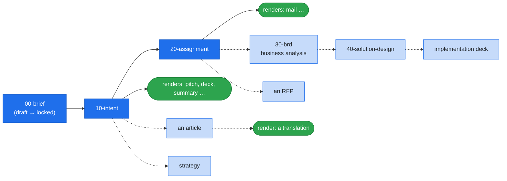

# Forge of Thought 4.31

*A workshop where thought is tempered and shaped.* · [Release notes](RELEASE-NOTES.md)

Forge of Thought is an **AI cognitive extension** of a thinking human,
the **principal** — the person whose thinking is being forged. It
takes a raw, half-formed idea — a process redesign, a platform
initiative, an organisational change, a D&D campaign — and tempers it
into a precise, self-contained handover for whoever delivers it: a
team, a colleague, your future self. It rests on one principle —
**the machine carries every part of the work that is not deciding** —
in three forms.

- **It thinks with you.** It interviews and probes, criticises,
  challenges and inspires; it extracts what you have not yet
  articulated and lays out the options with their trade-offs. It
  proposes — you decide.
- **It keeps the work consistent.** Nothing wanders off in forgotten
  chats: the thinking lives in versioned, templated artefacts, with
  decisions, state and history keeping themselves in order and
  consistency guarded across every output.
- **It carries the tedious work.** Audience-facing outputs — a pitch,
  a deck, even this README — are **renders**: generated from the
  artefacts through recipes, regenerated whenever the thinking moves,
  never written by hand twice.

Technically, the forge is a git repository: slash commands and
isolated agents — challenger personas and critic lenses — for Claude
Code, templates, and the conventions binding them. Today the chain
runs from the brief through the intent to the assignment; that is
where it currently ends.

Short on time? Two one-page notes say it briefly:
[for a CTO](projects/forge/renders/cto-pitch.md) and
[for a CEO](projects/forge/renders/ceo-pitch.md). Each has a Word
version beside it.

## 1. Better with AI, or replaced by it?

Forge of Thought is for those who chose to be better. The failure
modes it exists to remove:

- Thinking scattered across chat sessions that die, taking their
  context with them.
- Handovers whose completeness depends on the mood of the day they
  were written.
- The same thinking retold to every audience — a pitch, a deck, a
  mail — each version rewritten by hand and drifting from the others.
- Feedback and decisions with no place to land, so the same ground is
  fought over twice.
- Assumptions nobody attacked before reality did.

## 2. What you get

- A versioned document chain growing from a **brief** — your own
  text, locked verbatim once it is done — to a self-contained
  **assignment**.
- An elicitation interview that forges the **intent**: the working
  understanding between you and Claude.
- Blind adversarial reviewers, every verdict recorded.
- Audience-specific renders generated from **recipes**, including an
  actual PowerPoint file through your own template.
- External sources registered immutably and used only as you direct.
- Everything in files and git — nothing depends on a chat's memory.

## 3. Quickstart

**First, once per machine**

```
git clone <this repository>     # you are looking at it
# install Claude Code            # see Setup below
claude                           # always from the engine root
/setup                           # first run only — fills CLAUDE.local.md,
                                 # sets the model (Fable)
```

**Starting a new project**

```
/new-project my-idea
/forge intent
/save
```

**Bringing an existing project**

```
/import-project <project url>    # clones into projects/ — the commit
                                 # identity is git's, resolved from your
                                 # own configuration
/forge <project-slug>            # the slug is the repository's name;
                                 # select the project before any work —
                                 # the forge cannot guess it
```

Each project lives inside `projects/<slug>/` as a git repository of
its own, which the engine does not track — that is why you name it
first.

## 4. How it is used

### The flow

A thought arrives — a process you want redesigned, a platform you
want built, a campaign taking shape for your D&D table. You dump it
verbatim as a brief, alone or in conversation with the forge, and
lock it. From then on it is the record of where you started.

Then the forge interviews you. Over days and sessions, `/forge intent`
draws out what you have not yet said, reflects it back, and writes it
into the intent — positions, facts, open threads, rejected directions
— all of it in files, none of it in a chat you will lose. A security
standard you downloaded last week goes into `sources/` through
`/ingest` and waits there, untouched, until you say the intent should
be verified against it; `/research` grounds the topics that deserve
current best practice rather than invention.

When the thinking feels solid, you send in the reviewers. A critic
reads the documents for their quality, a challenger attacks the
substance; neither has seen the conversation, so neither can be told
what you really meant. Nothing they find blocks you: you walk through
their findings one at a time and decide.

When the intent is ready, `/forge assignment` distils it into the one
document the recipients receive — complete, precise, self-contained.

Along the way you want outputs: a pitch for the group, slides for the
board, a mail, this very README. Each is a render of a recipe, and a
recipe can be composed through a genre interview (`/recipe
presentation`) instead of from scratch. `/render` regenerates the
Markdown and, where the recipe asks for it, the plain PowerPoint
beside it; `/publish` makes the designed file when you say so. Every
release regenerates the README and release notes. `/save` and
`/release` keep it all in git.

### What it looks like in practice

A worked example from a real project will appear here once one is
published.

## 5. How the work feels

The forge is as much a way of working as a set of files, and these
are the named methods of that work — the vocabulary you and Claude
share.

- **Walkthrough.** Any list of items needing your decision is worked
  one item per message, in order of weight, each ending in the
  verdict line `(a)ccept / (m)odify / (r)eject / (p)ark`, and the
  verdicts are carried to one write at the end of the round. Whatever
  produces a list — a critique, a challenge, the `/forge` map — ends
  by offering one.
- **Propose, never decide.** Claude criticises, challenges, inspires
  and lays out options; you compose — and `??` at the end of your
  message asks for Claude's honest opinion of what you just wrote.
- **Step by step.** Anything hard to reverse — a write, a commit, a
  rename, the birth of a new document — arrives as one step with the
  exact operation and reason, and runs on your word; a plan you have
  seen is not consent for its steps.
- **Elicitation interview.** Claude draws out by questions what you
  have not yet articulated, one question per message, never filling a
  gap by assumption.
- **In pieces.** You may send one longer thought as several messages
  and close it with a word such as "done"; until then Claude answers
  each piece with at most one line, and afterwards works the pieces
  as one input.
- **Draft early.** An early draft is an elicitation tool, not an
  output: concrete text sharpens your reaction.
- **Reflect back.** Before writing, Claude restates what it
  understood, so the write confirms rather than surprises.
- **One write per round.** A working conversation is one round; what
  is agreed is carried in the conversation and written once at its
  end, on your word — the word is `write`.
- **Intent-first.** Substance changes go into the intent and
  propagate from there; only wording is fixed downstream directly.
- **Recommend, do not push.** Every option comes with a
  recommendation and its reason, stated once; a declined
  recommendation is not re-argued without new facts.

None is a command: you invoke any of them in a word.

| You type | What it does |
|---|---|
| `a`, `m`, `r` or `p` | Answers the verdict line `(a)ccept / (m)odify / (r)eject / (p)ark`, as your whole message. |
| `write` | Orders the write of everything agreed in the round. Claude shows you the round first and writes on your yes. |
| `??` | Asks for Claude's honest opinion of what you have just written. Three points at most, nothing written. |

## 6. Roles

| Role | What they own |
|---|---|
| Principal | Whoever's thinking is being forged: supplies ideas, answers and decisions, and is the final authority on all content. |
| Claude | The principal's cognitive extension: structure, order, process discipline and document hygiene; it proposes, never decides. |

The standing rules of the collaboration: when unsure, Claude asks and
never fills a gap by assumption — a contradiction or a gap it finds in
a source is raised at once as a question, never as an interpretation;
it never introduces a new convention, prefix or section on its own,
but proposes it and waits; it researches before inventing; its
critiques and checklists inform and never block — only the principal
publishes, and a missing section may be a deliberate delegation
rather than a defect; structure beats prose, with stable IDs even at
very high abstraction; and every mechanism the forge has lives in one
place and is used through its own definition, never re-described.

One instance serves one principal; the recipients collaborate through
the artefacts, and more principals means more instances (see Planned
extensions).

## 7. The document chain


```mermaid
flowchart LR
    B["00-brief<br>(draft → locked)"] --> I["10-intent"]
    I --> A["20-assignment"]
    I --> RI(["renders: pitch, deck, summary …"])
    A --> RA(["renders: mail …"])
    A -.-> BRD["30-brd<br>business analysis"]
    A -.-> RFP["an RFP"]
    I -.-> ART["an article"]
    ART -.-> RT(["render: a translation"])
    I -.-> ST["strategy"]
    BRD -.-> SD["40-solution-design"]
    SD -.-> IMP["implementation deck"]

    classDef built fill:#1f6feb,stroke:#1158c7,color:#ffffff
    classDef future fill:#c6dbfa,stroke:#1f6feb,color:#24292f
    classDef render fill:#2da44e,stroke:#1a7f37,color:#ffffff
    class B,I,A built
    class BRD,RFP,ART,ST,SD,IMP future
    class RI,RA,RT render
```

**Blue = chain artefacts (light = not built yet), green = renders; dashed arrows = growth that does not exist yet.**

Adding a layer is one definition file declaring its inputs — nothing
is renumbered and nothing existing is reworked, which is why files
are numbered in tens. The boundary between the two colours is
authorship: a chain artefact is composed by the principal, a render
is generated from artefacts — the article and its translation in the
diagram illustrate it.

| File | What it is |
|---|---|
| `00-brief.md` | The idea as the principal wrote it — draft until locked, then verbatim; later wholes as `00-brief-<name>.md`. |
| `10-intent.md` | The working understanding of principal and Claude — rewritten freely, versioned. |
| `20-assignment.md` | The direction handed to the recipients — the only document they receive, versioned. |
| `<file>.history.md` | The Version History of each versioned document — an append-only companion beside it. |
| `decisions.md` | Append-only DEC records: the principal's decisions with reasons. |
| `ledger.md` | The single source of truth for state. |

> A locked brief is immutable — composed, then locked, never touched
> again.

The brief is an intent that is composed and then locked: `draft`
while being written, `approved` (1.0) once you lock it. It is
free-form — any structure you find useful, prose, headings, tables,
use cases — with no required content and no IDs: thoughts to be
processed, not decisions, so they may be changed, reworked or dropped
when mined. Three origins are equally legitimate and indistinguishable
to the forge: it arrives finished and is locked on arrival; it is
begun outside and finished with Claude; it is born in the forge —
`/forge brief` is the door for the latter two. Born by elicitation,
it carries everything the conversation, the research and the sources
yielded, your words unmarked and every other block opening with its
origin. A project may have more than one: every later whole of
thinking that would otherwise land in the intent as a batch of
unproven positions is born as `00-brief-<name>.md` under the same
rules. A locked brief is mined into the single intent — positions
cite it as provenance — and the **ledger** tracks how far each brief
is mined (`pending | partial | mined | dropped`).

The intent is the consolidated *current* state of what you want, why,
what is the case, what is open and what was rejected: positions
(POS), facts (FCT), open threads (THR) and rejected directions with
the reason they were dropped (REJ), each with a stable ID. It is
rewritten for coherence every round rather than appended, its changes
recorded in its history companion. It exists because chat context
dies and anything of value must live in a file: it is the document to
read when returning to a project after weeks, instead of excavating
old conversations. Its audience is you and Claude only. An intent
Claude consolidated from the conversation, rather than composed item
by item with you, is `in_review` until every position has been walked
through; no lower layer is derived before that.

The assignment is distilled from the intent for the recipients —
teams, colleagues, or your future self — and is the one document they
receive: requirements, out-of-scope items, constraints, assumptions,
deliverables, open questions with an owner and optional success
criteria (REQ, OOS, CON, ASM, DEL, TBC, SCR). It is complete and
precise, assigning rather than solving, and self-contained.

Iteration is intent-first: substance changes go into the intent and
propagate downward, with early drafting as a legitimate tool. Each
round is written once, on confirmation, as one version bump and one
Version History row. Feedback from recipients has no channel of its
own: you process it and feed the conclusions back through
`/forge intent`.

> A render is never edited by hand — what is iterated is its recipe.

**Renders and recipes.** A **recipe** (`recipes/<recipe>.md`) holds
the inputs, the audience, the instructions and the output template in
one versioned file; `/render <recipe>` regenerates the output into
`renders/<recipe>.md` — or the recipe's optional `output:` path —
overwriting freely, with history in git, in an isolated subagent that
sees only the recipe and its inputs. Every render opens with YAML
front-matter provenance citing the recipe and each input with their
versions, and a render may serve as an input of another render — a
picture source, say — when the recipe declares it. A render assigns
nothing and is not part of the chain: the artefacts stay the source
of truth.

**From Markdown to slides.** Everything is Markdown, content only; a
presentation is a `.md` saying what is on each slide. Composing a
recipe may be guided by genre (`/recipe presentation`). An output is
made in two steps, each with its own command. `/render` makes the
Markdown and, where the recipe names a format in its `Format`
section, the plain `.docx` or `.pptx` beside it through pandoc —
cheap, the same every time, Mermaid diagrams staying as blocks of
code. `/publish` makes the designed file through a model into
`published/` — expensive, started by you only, from the Markdown as
it lies on disk, never rendering and sending nothing anywhere; where
the render is older than its recipe or its inputs, it says so first
and waits for your word. A recipe without a format ends at the
Markdown. A deck template or a Word reference document is named by
path — typically a document of a library project — and the page is
A4 by default. The Markdown stays the source of truth; all other
format conversion happens outside the forge.

## 8. Isolated reviewers

The reviewers run as isolated subagents that see the project's
documents only, never the working conversation: they cannot be told
what we really meant, and that blindness is the source of their
value. Every kind of reviewer is of one shape — one agent file per
lens, persona or check, the shared behaviour of the kind preloaded
from one contract, only the Lens section its own — and all run on the
session model, the same one Claude works on. All are invoked by hand
and settled by walkthrough; none runs on Claude's own judgement.

Isolation is not independence. The reviewers share the author's model
family: what that family systematically cannot see, none of them will
find, so agreement between them is never validation — it only means
the artefact is consistent under one set of priors. The calibration
point lies outside the forge: review by humans or by a different
model family, invited at the principal's discretion.

### Critic (`/critique`)

The **critic** judges the quality of the documents, never the
substance of the thinking. Command: `/critique <lens> [artefact]` —
one artefact when named, else all; bare `/critique` lists the roster.

- `clarity` — reads each artefact on its own for ambiguity,
  contradiction, duplication, scope hygiene and Requirement style.
- `essence` — reads the chain for drift: distils each layer's essence
  blind and compares it with the layer above.

Output: FND findings in an immutable dated report,
`reviews/YYYY-MM-DD-critique-<lens>.md`, with ledger rows. Finding
states:

- open
- resolved
- rejected (→ DEC)
- parked
- obsolete

### Challenger (`/challenge`)

The **challenger** judges the substance of the thinking, never
document quality. Command: `/challenge <persona> [artefact]` — the
named artefact, else the whole chain; bare `/challenge` lists the
roster.

- `cto` — CTO-level peer reviewer; challenges the substance of the
  principal's thinking: assumptions, blind spots, second-order
  effects, organisational reality.

Output: CHL challenges in an immutable dated report,
`challenges/YYYY-MM-DD-challenge-<persona>.md`, with ledger rows; an
accepted challenge must change the intent. Challenge states:

- open
- accepted
- rejected (→ DEC)
- parked
- obsolete

### Checks (`/check`)

A check judges mechanical conformance with the conventions, never
substance or quality; each owns one concern and none another's.
Command: `/check <check> [slug]` — a project by its slug, or the
engine; bare `/check` lists the roster.

- `light` — verifies a project's bookkeeping: front-matter against
  the history companion, ledger tables against the files,
  dependencies and resource indexes against the directories; fit for
  a save.
- `project` — verifies a project's structure, IDs, assignment style,
  language, immutables, recipes and renders against the conventions.
- `engine` — verifies the core (CLAUDE.md, templates, skills, agents,
  scripts) against itself and against the forge intent: every
  position honoured, nothing withdrawn still advertised, every
  decision reflected.
- `single-source-of-truth` — verifies that every rule, procedure and
  file shape is written in one place and cited everywhere else: no
  restatement across CLAUDE.md, skills, agents, templates and
  scripts, no direct operation where a mechanism exists; expensive by
  design, fit before a major or after a round on the operating layer.

Output and states:

- nothing filed — the report returns to the session and is settled
  there.

## 9. Commands

The commands are the entry points into the work; each is defined in
one skill file that Claude reads when it runs.

| Command | Purpose |
|---|---|
| `/setup` | First run after cloning the engine: fills `CLAUDE.local.md` by interview, creates `.claude/settings.local.json` with the model set to Fable, and offers the git identity per host. Never overwrites, runs no git operation. |
| `/new-project <slug>` | Scaffold a project by kind — files only, never git: a thought project with its brief captured verbatim, or a library (`lib-`) of shared material. |
| `/import-project <git-url>` | Bring an existing project into `projects/` through `scripts/forge-clone.ps1`; the directory is the repository's name. |
| `/forge [slug]` | The chain map: artefacts, versions, possible next steps, stale renders and published files — with a recommended next step. |
| `/forge <state> [slug]` | Iterate the target artefact (`brief [name]`, `intent`, `assignment`, …): the command is simply the name of the artefact you want to work on. |
| `/ingest [file] [slug]` | Store and register external input — a file, or pasted text — in `sources/` and index it; bare = sweep `sources/`. |
| `/render <recipe> [slug]` | Regenerate a render from its recipe and, where the recipe names a format, its plain file through pandoc. |
| `/publish <recipe> [slug]` | Make the designed `.pptx` or `.docx` from the render of that recipe, through a model; started by the principal only. |
| `/recipe [genre] [slug]` | Bare = genre roster; with a genre (`presentation`, `readme`, `release-notes`), guided composition or iteration of a render recipe. |
| `/critique [lens] [artefact] [slug]` | Bare = lens roster; with a lens, run that critic on the quality of the documents → review + ledger. |
| `/challenge [persona] [artefact] [slug]` | Bare = persona roster; with a persona, run that challenger against the substance of the named artefact, else the whole chain. |
| `/research <topic> [slug]` | Best-practices research → `research/`, indexed. |
| `/ledger [slug]` | The quick state readout from the ledger. |
| `/check [check] [slug]` | Bare = check roster; with a check, run it on the named project or on the engine — report to the session, nothing filed. |
| `/save [slug] [-m "message"] [-Tag name]` | Save one repository, or every one with changes: the `light` check, then commit and push on the current branch; a tag on request. |
| `/release [slug] [-m "message"] [-Tag name]` | Release one repository from `main`: its checks, the README and release notes re-rendered, then a save with the release message and the tag. |
| `/spinoff <project> <group> <slug>` | Split a requirement group into its own project — only by your explicit decision. |
| `/man [command \| method]` | The forge's manual, read from its own definitions: bare = commands and methods; with a command, its purpose, arguments and roster; with a method, its paragraph and skill. |
| `/manual …` | Alias of `/man`. |

`/ingest` stores, registers and catalogues — nothing more: it asks
what the source is for, records its role in the resource index,
stops before personal matter, and converts a binary to a Markdown
extract only on your explicit word; sources may arrive at any stage,
even before the brief. `/save` runs the `light` check and then
commits and pushes on whatever branch is checked out, with no render.
`/release` runs from `main` only: its checks, settled with you, then
the README and release notes re-rendered, then the save with the
release message and, at an approved major, the tag `v<major>`. The
commands are entry points, not the only door: the same rules apply in
plain conversation, and you may simply talk.

### A typical journey

- You have an idea and write it down as it is in your head; the forge
  captures it verbatim and locks it as the brief of your project
  (`/new-project`).
- You want to understand what you actually mean, so you let the forge
  interview you, session after session, until the intent holds your
  positions, facts, threads and rejections (`/forge intent`).
- You want the thinking attacked before reality does it, so you send
  in a challenger and a critic, then walk through their verdicts one
  at a time (`/challenge cto`, `/critique clarity`).
- You need to present it to the group, so you compose a presentation
  recipe by interview and render it — the plain PowerPoint arrives
  beside the Markdown, and the designed one when you ask for it
  (`/recipe presentation`, `/render`, `/publish`).
- You distil the direction for the people who will deliver it, and
  they receive one self-contained document (`/forge assignment`).
- You save as you go and release when a version is approved (`/save`,
  `/release`).

## 10. Conventions

**IDs and numbering.** Every item carries an ID `PREFIX.NNNN`, all
prefixes three letters; IDs are global and stable — never renumbered,
and an item may move between groups without changing its ID. Items
are numbered in tens (`REQ.0010, REQ.0020`), each new group starting
at the next hundred (`REQ.0100, REQ.0110`); overflow takes the next
free number anywhere. Groups are plain headings with no IDs, at most
two levels deep.

| Prefix | Meaning | Lives in |
|---|---|---|
| REQ | requirement | assignment |
| OOS | out of scope / do-not | assignment |
| CON | constraint — deliberate boundary, not to be challenged | assignment |
| ASM | assumption | assignment |
| DEL | deliverable — may delegate work ("produce NFRs and return") | assignment |
| TBC | open question / to be confirmed, with owner | assignment |
| SCR | success criterion — optional or delegated | assignment |
| POS | position the principal currently holds | intent |
| THR | open thread — unresolved matter to elicit next; carries its origin | intent |
| REJ | rejected direction, with the reason it was dropped | intent |
| FCT | fact — what is the case, as the principal or a source states it; not a stance | intent |
| FND | critique finding (document quality) | ledger, reviews |
| CHL | peer-review challenge (substance) | ledger, challenges |
| DEC | decision, incl. rejected findings and challenges | decisions.md |

**Terms.** Defined terms are capitalised in item text to signal that
they appear in the assignment's Terms section, so the document can be
forwarded without oral tradition.

**Language.** The forge dictates one output language per project: the
artefacts of the chain — intent, assignment, later layers — are
written in the language the project's ledger header declares
(`language`, English when absent). The briefs are the exception,
stored verbatim in whatever language they were written. Everything
else a project holds — ledger, decisions, history, reviews,
challenges, indexes, research, recipes — is always English, as is the
notation (ID prefixes, `shall`, status words, front-matter keys). A
render may be in any language its recipe declares. The conversation
language is per-instance configuration, living in `CLAUDE.local.md`.

**Requirement style.** Items use *shall* / *shall not* — never would,
could, should, might, may or MoSCoW wording. There is no priority
column and no priority tag: everything in an assignment is essential,
and an exception carries a note reading *optional*. Each item covers
one idea, is written once, and is written in full, correct UK English
sentences; it must not depend on an external link to be understood,
agreed or later tested. Testability is recommended, not required —
assignments are deliberately high-level, and delegating
concretisation through a DEL item is a legitimate outcome; the critic
reports untestable wording as a recommendation, never as a blocking
defect. For illustration only:

> REQ.0010 The Platform shall record every request and every response
> passing through the Gateway, with the identity of the requesting
> User and the time.

**Completeness over brevity.** An assignment carries the full
in-scope substance of the intent, written as well and as precisely as
possible; nothing is omitted for brevity's sake, and length is
whatever fidelity requires — leaving a matter out is legitimate only
as an explicit delegation (a DEL or TBC item). The boundary is the
kind of content, never its amount: an assignment assigns, it does not
solve; the machinery of executing delivery belongs to the recipients.

**Versioning.** Integers denote signed-off versions: `0.1, 0.2, …`
are drafts before first approval, `1.0` is approved, `1.1, 1.2, …`
are changes made after approval and not yet approved themselves, and
`2.0` is the next approved version incorporating all changes since
`1.0`. Front-matter carries `version`, `date`, `status`
(`draft | in_review | approved | superseded`) and `last_change`, and
the status must agree with the number.

**Document kinds.** "Document" is the word for every file of a
project; "artefact" is reserved for the documents of the chain — the
ones the principal composes, the reviewers read and the renders are
generated from.

| Group | Kind | Meaning | Written by | Versioned | Behaviour |
|---|---|---|---|---|---|
| artefacts | brief | the idea as it emerged: the principal's words alone when handed over finished, the whole pile of the elicitation when born in the forge | principal, with Claude's part marked | yes | locked at 1.0, then immutable |
| artefacts | intent | current understanding for principal and Claude: positions, facts, threads, rejections | Claude, principal composes | yes | rewritten freely |
| artefacts | assignment | the direction handed to the recipients, self-contained | Claude, principal composes | yes | rewritten freely |
| artefacts | later artefacts (BRD, RFP, article…) | further layers, each derived from the one above | Claude, principal composes | yes | rewritten freely |
| records | history | what changed in a versioned document, and why | forge | — | append-only |
| records | decisions | the principal's decisions with reasons | forge | — | append-only |
| records | review, challenge | one dated reviewer run | reviewer agent | — | immutable |
| state | ledger | single source of truth for state | forge | — | freely rewritten |
| state | index | catalogue of a resource directory | forge | — | freely rewritten |
| rendering | recipe | how a render is made | Claude, principal iterates | yes | iterated, never approved |
| rendering | render | audience-specific output, never a source of truth | generated | — | overwritten by /render |
| resources | source | external input as it arrived | external, /ingest | — | immutable |
| resources | research | durable answer to one question | Claude, /research | — | immutable |

Every versioned kind keeps its Version History in an append-only
companion `<file>.history.md` beside it, and `last_change` in the
front-matter summarises the newest row. An integer version is
approved, and a recipe never is.

**Project kinds and naming.** A project is of kind `thought` — the
chain — or `library`: shared material with no chain, only the ledger,
sources, research and a README as the catalogue of what it holds.
Project slugs are lowercase and hyphenated on disk, as in `forge`,
the system's own project; a library carries the `lib-` prefix
(`projects/lib-<name>/`).

## 11. Repository layout

```
CLAUDE.md                  # this file — universal core
CLAUDE.local.md            # instance facts (principal, conversation
                           # language) — gitignored, created by
                           # /setup from templates/CLAUDE.local.md
README.md                  # for humans — a render (/render readme)
RELEASE-NOTES.md           # release notes — a render (/render
                           # release-notes): one section per
                           # release, compiled from the Notes of
                           # the intent's history rows; minors
                           # fold into a major
logo.png                   # project avatar
LICENSE                    # CC BY 4.0 — the engine is published
                           # under attribution
scripts/                   # forge-save / forge-pull / forge-status
                           # / forge-clone / forge-branch (git),
                           # doc2md (document →
                           # Markdown), md2pptx (deck render →
                           # PowerPoint), md2docx (render → Word),
                           # each by pandoc or by a model,
                           # hook-walkthrough (the per-prompt hook
                           # of .claude/settings.json)
.claude/                   # skills (the commands, the reviewers'
                           # contracts and the walkthrough method),
                           # agents, settings
                           # (settings.local.json: the session
                           # model — gitignored)
templates/                 # canonical skeletons
projects/                  # gitignored (projects/*) except
                           # projects/forge — every other project is
                           # a git repository of its own, which the
                           # engine does not know
projects/<slug>/           # kind: thought — the chain
  .git/                               # the project's own repository
  README.md  RELEASE-NOTES.md         # renders (Document chain 7)
  logo.png                            # optional project avatar
  00-brief.md  10-intent.md  20-assignment.md
  00-brief-<name>.md                  # later briefs, one per whole
  <file>.history.md                   # Version History of each
                                      # versioned document (brief,
                                      # intent, assignment, recipe):
                                      # append-only companion
  decisions.md  ledger.md             # ledger header carries kind:
  sources/00-INDEX.md                 # resource index (rewritten)
  sources/<name>.<ext>                # immutable external inputs, one
                                      # form each: <slug>.md extract of
                                      # a binary, or the binary itself
  sources/.gitignore                  # originals converted in place
  sources/<slug>/                     # bundle of related files = one
                                      # source, one ledger entry;
                                      # catalogued by its 00-INDEX.md
  research/00-INDEX.md                # resource index (rewritten)
  recipes/<recipe>.md                 # render recipes: inputs, audience,
                                      # instructions, template — iterated
  recipes/<recipe>.history.md         # the recipe's Version History
  renders/<recipe>.md                 # generated outputs, overwritten by
                                      # /render, provenance front-matter
  renders/<recipe>.pptx               # the plain file of a render, made
  renders/<recipe>.docx               # by /render through pandoc where
                                      # the recipe names a format
  published/<recipe>.pptx             # the designed file, made by
  published/<recipe>.docx             # /publish through a model
  reviews/YYYY-MM-DD-critique-<lens>.md  # immutable critique runs
  challenges/YYYY-MM-DD-challenge-<persona>.md  # immutable peer reviews
  research/YYYY-MM-DD-<topic>.md      # immutable research notes
  CLAUDE.md                # optional project-specific polish; note
                           # that Claude Code's /export writes into
                           # the working directory — export outside
                           # the project or gitignore it
projects/lib-<name>/       # kind: library — material shared across
  .git/  ledger.md         # projects, no chain: only the ledger,
  README.md  logo.png      # sources and research; documents
  recipes/readme.md        # maintained by their owner; README =
  recipes/readme.history.md  # the catalogue, a render of its recipe
  sources/00-INDEX.md
  research/00-INDEX.md
```

## 12. Setup

### Prerequisites

- git
- PowerShell 7 (`pwsh`) — the scripts are PowerShell, needed on macOS
  and Linux too
- Python 3 (for markitdown)
- a paid Claude subscription

### Getting the forge and Claude Code

Clone this repository — it is the engine. Install Claude Code:

- Windows: `irm https://claude.ai/install.ps1 | iex`
- macOS/Linux: `curl -fsSL https://claude.ai/install.sh | bash`
- or `npm install -g @anthropic-ai/claude-code`

Sign in on first run — usage draws from the same pool as Claude chat.
Always start `claude` from the engine root so that `CLAUDE.md` and
`CLAUDE.local.md` load.

Then run `/setup` once. It fills `CLAUDE.local.md` — the conversation
language, who the principal is — from its template with you in a
short interview; the file is gitignored and never committed. It
creates `.claude/settings.local.json` with the session model set to
Fable, the strongest available model, which the whole forge including
the blind reviewers runs on; it tells you so in one sentence, and
`/model` or editing that file changes it at any time (permissions
come from the shared `.claude/settings.json`). It closes with your
git identity, which is git's own: it asks for the hosts you push to,
with a name and an e-mail for each, and offers to write the
`includeIf` stanzas into your `~/.gitconfig` — one identity per host,
resolved by git from the remote's URL — together with one global
guard, `user.useConfigOnly = true`, so that a repository on a host
with no stanza fails aloud instead of committing with a default;
declined, it prints the lines for you to apply by hand. The forge
itself sets no identity anywhere. `/setup` never overwrites existing
files.

### Your projects

Each project is a directory under `projects/` and a git repository of
its own. `/new-project` creates the files; `git init` in that
directory (`git -C projects/<slug> init -b main`) and a remote if
wanted are a one-off act of yours, and the commit identity is git's,
resolved per host from your own configuration. An existing project is
brought in with `/import-project <git-url>`, which clones it into
`projects/<repository name>` through `scripts/forge-clone.ps1` and
reports the identity git resolves for it. The engine ignores
`projects/*` (except its own `projects/forge`), and the scripts find
your project through its `.git`. A project without a repository is
reported as "not under git" — a fact, not an error.

### Script prerequisites

- `doc2md.ps1` needs markitdown:
  `pip install "markitdown[docx,pptx,pdf,xlsx,xls]"`.
- `md2pptx.ps1` and `md2docx.ps1` each have two engines
  (`-Engine pandoc | claude`), and each engine its own need. The
  `pandoc` engine, behind `/render`, needs pandoc
  (https://pandoc.org/installing.html). The `claude` engine, behind
  `/publish`, needs the `document-skills` plugin, installed once from
  an interactive Claude Code session:
  `/plugin marketplace add anthropics/skills`, then
  `/plugin install document-skills@anthropic-agent-skills`. A deck
  template is named by path (`-Template <file.potx>`), a reference
  document for Word likewise (`-Reference`, a `.docx`, `.dotx` or
  `.dotm`) — typically a document of a library project — or none, in
  which case the model designs the visuals and pandoc's built-in
  styles apply on an A4 page (`-PageSize Letter` for US Letter).
- The git scripts need nothing beyond git.

### Saving and syncing

Two doors, two speeds. `/save` runs the `light` check, then commits
and pushes on the current branch, with no render. `/release`, from
`main` only, runs its checks, settled with you, offers
`critique essence` once, re-renders the README and release notes and
then saves with the release message and, at an approved major, the
tag `v<major>`.

The scripts in `scripts/` are the underlying mechanism and, for
Claude and every command of the forge, the only door to git — reading
state included, enforced by the deny rules of
`.claude/settings.json`. Each serves the engine and every project
repository: `forge-save.ps1` commits and pushes — a bare save commits
each repository with changes on its own and pushes where it has a
remote — `forge-pull.ps1` fast-forwards from the remotes,
`forge-status.ps1` reports state without changing anything,
`forge-clone.ps1` brings an existing project in, and
`forge-branch.ps1` creates or switches a branch while merging stays
with git, by hand or by merge request. `main` is the released line,
branches are voluntary, one remote per repository, and the scripts
carry no URL and no identity. Saves made directly from the shell are
unaffected.

### Upgrading

Upgrading the engine is `scripts/forge-pull.ps1`, a fast-forward of
`main`; your projects are untouched by it and record no engine
version. Read `RELEASE-NOTES.md`, the *Action required* lines first:
they say what a new version expects of your projects and your
instance files. Then, project by project, run `/check project <slug>`:
it measures the project against the current conventions and reports
what no longer conforms, nothing else. Go through the findings with
Claude one at a time and agree what to migrate and how; Claude makes
the changes on your word, in the session, with no migration tool in
between — the check and the release notes are the tool. A project you
leave as it is stays valid under the conventions it was written to;
migrating it is your decision, per project, never assumed.

## 13. Scripts

| Script | Purpose | When it runs | Install |
|---|---|---|---|
| `forge-save.ps1` | Commits and pushes the engine or a project repository. | Behind `/save` and `/release`, or from the shell. | git only |
| `forge-pull.ps1` | Fast-forwards from the remotes; on the engine, the upgrade channel. | When upgrading the engine or syncing a project. | git only |
| `forge-status.ps1` | Reports the state of the repositories without changing anything. | Whenever Claude or you read git state. | git only |
| `forge-clone.ps1` | Brings an existing project repository into `projects/`. | Behind `/import-project`. | git only |
| `forge-branch.ps1` | Switches to or creates a branch; merging stays with git. | When you want a branch. | git only |
| `doc2md.ps1` | Converts a binary document to a Markdown extract that becomes the source. | Behind `/ingest`, on your explicit word. | markitdown — see Setup |
| `md2pptx.ps1` | Turns a Markdown deck render into a PowerPoint file, by pandoc or by a model. | Behind `/render` (pandoc) and `/publish` (claude). | pandoc, or the document-skills plugin — see Setup |
| `md2docx.ps1` | Turns a Markdown render into a Word file, by pandoc or by a model. | Behind `/render` (pandoc) and `/publish` (claude). | pandoc, or the document-skills plugin — see Setup |
| `hook-walkthrough.ps1` | The per-prompt hook: repeats the one-item walkthrough rule and three lines of conduct at every prompt. | On every prompt, configured in `.claude/settings.json`. | none |

## 14. Planned extensions

The chain is meant to grow downward, as far as a thought needs to be
taken: a BRD layer is certain to come, solution architecture and
integration are intended, and a strategy layer is possible if it
proves to make sense. Which layers are added, and in what order, is
open; the mechanics of a layer are designed when that layer is
actually taken up, not in advance. The layers below the assignment
grow in the same project, by the same principal's hand; what a
recipient does with an assignment is his own forge run, in which the
assignment becomes his brief. The chain never spans two principals:
more principals means more instances, coordinated through git.

`projects/forge/` is the system's own project — Forge of Thought run
through its own process, with its brief, intent, decisions and
ledger; a change to the process is complete only once that intent is
updated and this README re-rendered.

## 15. Author and licence

Forge of Thought © Petr Chlumsky (PCHe) — petr.chlumsky@gmail.com.
Licensed under [CC BY 4.0](LICENSE): use and adapt it freely; credit
the author and link to this repository.

## 16. About this README

This file is a render of `projects/forge`: never edited by hand,
regenerated by `/render readme` whenever the process changes and by
every `/release` of the engine. Fixes go into the recipe
(`projects/forge/recipes/readme.md`) or its inputs, never here. The
YAML front-matter provenance at the top is kept by design; changes to
the system are recorded in `projects/forge/`.

_Last updated: 2026-09-27_
