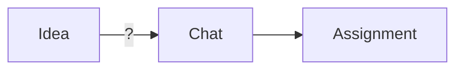
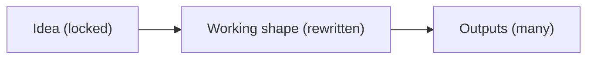
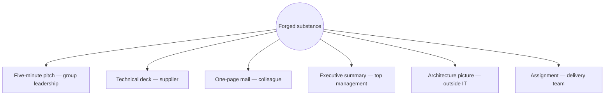

## Build instructions
- Template: none — `scripts/md2pptx.ps1` runs without `-Template`
  and designs the visual style itself: dark background, one accent
  colour, generous whitespace (principal's decision of 2026-09-10; no
  `.potx`).
- Model: opus.
- Never let text overflow: if a slide's lines do not fit at the
  template's body size, shorten nothing — move the last line to the
  notes and say so in the build log. Redraw Mermaid diagrams as
  native shapes with the same node labels; no rendered images of
  Mermaid. The bold closing line of each slide is set apart visually
  (larger, accent colour, bottom of the slide). No slide numbers, no
  footer, no logo.

## S01 — The chat answers. Nobody checks the question.

**On slide:**

The chat answers. Nobody checks the question.
Idea → chat → good answer → e-mail → assignment.
The answer takes a minute.
What was in the head was never examined.
The error is not in the answer but in the question.
**The mistake is upstream of the answer.**

**Diagram:**

**Speaker notes:**

You all know this picture. Someone has an idea, types it into a
chat and gets a good answer within a minute — and the answer really
is good. It goes into an e-mail, and the e-mail becomes a team's
assignment. But nobody examined what was in that person's head before
they typed. The chat answered the question it was given; whether it
was the right question, nobody checked. The mistakes we pay for later
were made there, before the answer.

## S02 — A forge, not a whisperer.

**On slide:**

A forge, not a whisperer.
The idea enters as written and never changes.
Hammered into a shape that holds: what I want, why, open, dropped.
Only then an output is cast — assignment, strategy paper, board proposal.
The AI asks, argues back, keeps order. The human decides.
**Substance forged once, form cast at the end.**

**Diagram:**

**Speaker notes:**

The forge starts where the chat stops: with the idea itself. The idea
enters exactly as written and is never changed — that is the anchor.
From it a working shape is hammered until it holds: what I actually
want, why, what is still open, and what I dropped and why. Only when
that holds is an output cast, and the output can be anything — an
assignment for a team, a strategy paper, a board proposal, an
argument for the supervisory board, input into someone else's
document. The AI does not compose the substance for you; it asks,
argues back and keeps order, and every decision stays yours. Form
comes last; the substance is forged once.

## S03 — Opponents that never saw you.

**On slide:**

Opponents that never saw you.
One opponent hunts what is unclear; another attacks the substance.
More join as needed; all work blind to the conversation.
Every objection ends in a written verdict: accepted, rejected with reason, open.
One enterprise platform project: 34 objections, 31 accepted, 3 rejected.
**An AI that argues back, and a verdict that is written down.**

**Speaker notes:**

This is the part a chat has never shown you: before the output
leaves, opponents read it, and each has one job. One reads only the
document and hunts for what is unclear or contradicts itself; another
reads only the document and attacks the substance — is this even the
right problem, what happens in a year. More are added as the need
shows, one for each angle the idea must survive. They work in
isolation: they do not know the conversation, so they cannot nod
along. Every objection ends in a recorded verdict — accepted, rejected
with a reason, or left open. On one enterprise platform project that
meant thirty-four objections: thirty-one accepted, three rejected
with a written reason, before a single team member saw the output.

## S04 — One idea, every audience in its own language.

**On slide:**

One idea, every audience in its own language.
From one forged substance, an output for every audience.
Tune the definition — for whom, what, how long — never the text.
Change the idea: everything regenerates at once, every output current.
No "which deck is right", no rewriting five documents after one change.
**Change the idea once; every output follows.**

**Diagram:**

**Speaker notes:**

The same forged substance feeds every audience. From it the outputs
are generated: a five-minute pitch for group leadership, a technical
deck for a supplier, a one-page mail for a colleague, an executive
summary, an architecture picture for someone outside IT. Each output
has its own definition — for whom, what, how long — and that is what
you tune; you never rewrite the text by hand. When the idea changes,
everything regenerates at once, and every output is at the current
version. No more asking which version of the deck is the right one,
no more rewriting five documents after one change.

## S05 — What it means for you.

**On slide:**

What it means for you.
An assignment that survives the team's first question.
Every decision carries a date and a reason — a year later too.
An idea from anyone, the same discipline for everyone, CEO to analyst.
**A chat gives you an answer. The forge gives you a decision you can stand behind.**

**Speaker notes:**

So what does this mean for you? Three things, not a feature list. An
assignment that survives the team's first question, because the
questions were asked before it left. Every decision carries a date
and a reason — and still does a year later, when somebody asks why.
An idea from anyone goes through the same discipline, from the CEO to
the analyst. A chat gives you an answer; the forge gives you a
decision you can stand behind.
