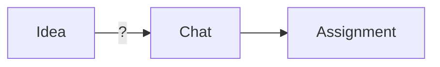
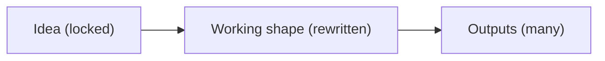
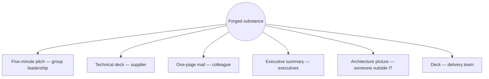

# Forge of Thought — Executive pitch

## S01 — The chat answers. Nobody checks the question.

**On slide:**
The chat answers. Nobody checks the question.
Today: idea → chat → good answer → e-mail → assignment.
The answer takes a minute.
What was in the head was never examined.
The error is in the question — and nobody reads the question.
**The mistake is upstream of the answer.**

**Diagram:**

```mermaid
flowchart LR
    A[Idea] -- "?" --> B[Chat]
    B --> C[Assignment]
```

**Speaker notes:**
You all know this picture, because you have done it. An idea forms,
you type it into the chat, you get a good answer within a minute,
and that answer goes out by e-mail as an assignment. The answer is
usually fine; that is not the problem. The problem is that what was
in your head went straight into the question, and nobody ever
examined the question — not you, not the chat, not the team that
received the mail. Whatever was missing or wrong in the idea is
still missing or wrong, only now it is written down and moving.

## S02 — A forge, not a whisperer.

**On slide:**
A forge, not a whisperer.
The idea enters as written and never changes.
A working shape is hammered until it holds: what, why, open, dropped.
Only then is an output cast: assignment, strategy paper, board proposal.
The AI asks, argues back, keeps order. The human decides.
**Substance forged once, form cast at the end.**

**Diagram:**

```mermaid
flowchart LR
    A["Idea (locked)"] --> B["Working shape (rewritten)"]
    B --> C["Outputs (many)"]
```

**Speaker notes:**
The forge does something a chat never does: it keeps your idea
exactly as you wrote it and does not let it change. From that idea a
working shape is hammered out and rewritten as often as it takes —
what you want, why, what is still open, what you dropped and why you
dropped it. Only when that holds is an output cast, and the output
can be anything: an assignment for a team, a strategy paper, a
proposal for the board, an argument for the supervisory board, input
to someone else's document. Form comes last; the substance is forged
once. The AI does not write your thinking for you — it asks, argues
back and keeps order, and every decision stays yours.

## S03 — Opponents that never saw you.

**On slide:**
Opponents that never saw you.
Each opponent has one job: what is unclear, or the substance itself.
They read only the document — never the conversation.
Every objection ends in a verdict: accepted, rejected with reason, open.
One enterprise platform project: thirty-four objections, thirty-one
accepted, three rejected.
**An AI that argues back, and a verdict that is written down.**

**Speaker notes:**
This is the experience none of you has had with a chat. Once the
working shape stands, it is handed to opponents, and each of them has
exactly one job: one reads nothing but the document and hunts for
what is unclear or contradicts itself; another reads nothing but the
document and attacks the substance — is this even the right problem,
what happens in a year? More are added as the need shows, one for
each angle the idea must survive. None of them knows the conversation
you had, so none of them can nod along; and every objection ends in a
recorded verdict — accepted, rejected with a reason written down, or
left open. On one enterprise platform project that meant thirty-four
objections, thirty-one accepted and three rejected with a written
reason, before a single member of the team had seen the assignment.

## S04 — One idea, every audience in its own language.

**On slide:**
One idea, every audience in its own language.
From the same substance, an output for every audience.
A leadership pitch, a supplier deck, a one-page mail, a team deck.
Each output has its own description: for whom, what, how long.
The idea changes; everything regenerates at once, at the current version.
**Change the idea once; every output follows.**

**Diagram:**

```mermaid
flowchart TB
    S((Forged substance))
    S --> A["Five-minute pitch — group leadership"]
    S --> B["Technical deck — supplier"]
    S --> C["One-page mail — colleague"]
    S --> D["Executive summary — executives"]
    S --> E["Architecture picture — someone outside IT"]
    S --> F["Deck — delivery team"]
```

**Speaker notes:**
Once the substance is forged, the outputs are generated from it for
each audience: a five-minute pitch for group leadership, a technical
deck for a supplier, a one-page mail for a colleague, an executive
summary, an architecture picture for someone outside IT, a deck for
the delivery team. Each output has its own short description — for
whom, what, how long — and that description is what you tune, never
the text of the output itself. When the idea changes, everything
regenerates at once and every output stands at the current version.
No more asking which version of the deck is the right one, and no
more rewriting five documents after one change.

## S05 — What it means for you.

**On slide:**
What it means for you.
An assignment that survives the team's first question.
Every decision carries a date and a reason — a year later too.
An idea from anyone; the same discipline for everyone, CEO to analyst.
**A chat gives you an answer. The forge gives you a decision you can stand behind.**

**Speaker notes:**
Three things, not a feature list. First, the assignment you hand
over survives the team's first question, because the opponents asked
it before the team could. Second, every decision carries a date and a
reason, so a year from now you can still say why — and so can whoever
inherits it. Third, the idea can come from anyone, and the same
discipline applies to everyone, from the CEO to the analyst. A chat
gives you an answer; the forge gives you a decision you can stand
behind.
